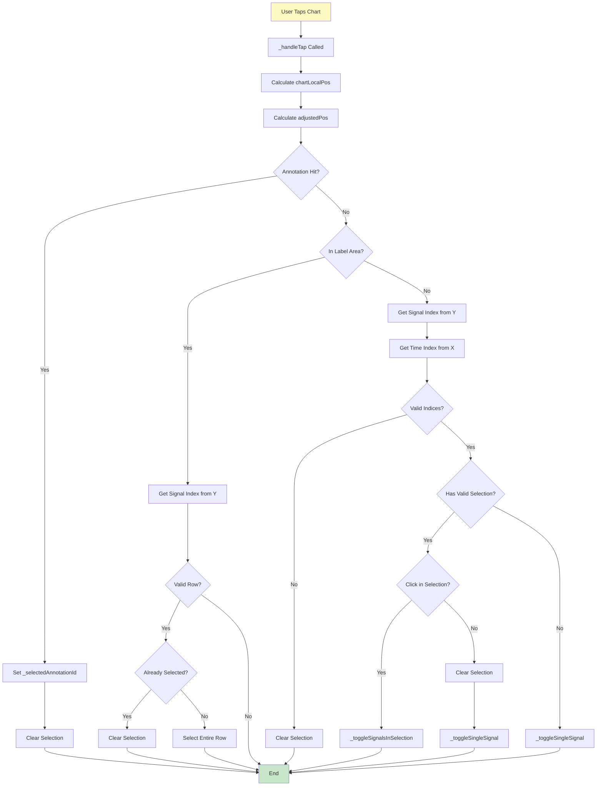
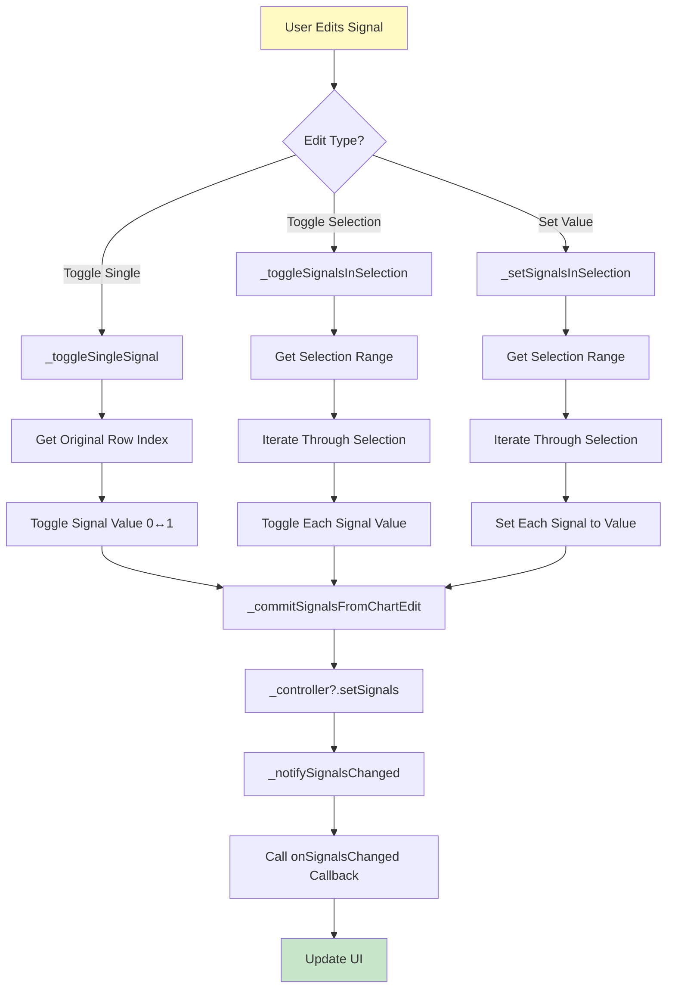
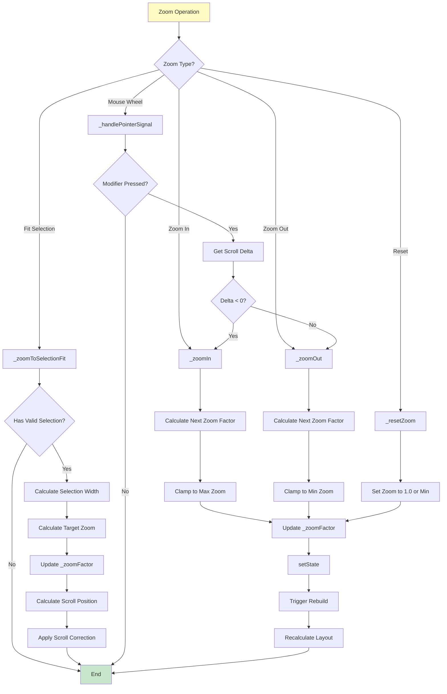
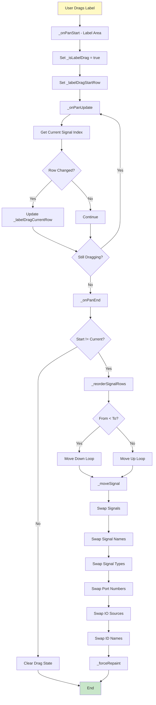

# TimingChart 処理フローチャート

このドキュメントは `timing_chart.dart` の主要な処理フローをフローチャートで説明します。

## 1. ウィジェット初期化フロー

```mermaid
flowchart TD
    A[TimingChart Widget Created] --> B[initState Called]
    B --> C[Initialize _idSignalNames from widget.initialSignalNames]
    C --> D[Initialize signalNames from _idSignalNames]
    D --> E[Call _translateNames]
    E --> F[Register Language Listener (suggestionLanguageVersion)]
    F --> G[Register Keyboard Modifier Handler (HardwareKeyboard)]
    G --> H[Initialize _isModifierPressed (Ctrl/Cmd state)]
    H --> I{Controller Provided?}
    I -->|Yes| J[Use Provided Controller]
    I -->|No| K[Create TimingChartController.fromInitial(..., omissionTimeIndices)]
    J --> L[Initialize signals from controller]
    K --> L
    L --> M[Initialize annotations from controller]
    M --> N[Register Controller Listener]
    N --> O[Widget Ready]
    
    style A fill:#e1f5ff
    style O fill:#c8e6c9
```

## 2. ビルド・レイアウト計算フロー

```mermaid
flowchart TD
    A[build Method Called] --> B{isEditingMode?}
    B -->|Yes| C[Listener(onPointerSignal) + LayoutBuilder]
    B -->|No| D[KeyboardListener + Listener(onPointerSignal) + LayoutBuilder]
    C --> E[Get Settings from Provider]
    D --> E
    E --> F[Call _calculateLayoutData]
    F --> G[Calculate maxLen from signals]
    G --> H[Calculate visibleIndexes]
    H --> I[Calculate availableWidth]
    I --> J[Get durationsForLayout (controller overrides settings)]
    J --> K[Calculate totalSteps (ms/step aware)]
    K --> L[Calculate baseCellWidth]
    L --> M[Calculate minCellWidthForFullView]
    M --> N[Calculate maxCellWidthAllowed]
    N --> O[Calculate zoom factors]
    O --> P[Calculate effectiveZoomFactor]
    P --> Q[Calculate cellWidth and cellHeight]
    Q --> R[Calculate totalWidth and totalHeight]
    R --> S[Calculate commentAreaHeight (measured height if available)]
    S --> T[Create _ChartLayoutData]
    T --> U[Call _buildChartContent]
    U --> V[Ensure stepDurations length (post frame)]
    V --> W[Build Visible Data Lists]
    W --> X[Build Widget Tree (UnitToggle + GestureDetector + ScrollViews + CustomPaint)]
    X --> Y[Render Chart]
    
    style A fill:#e1f5ff
    style Y fill:#c8e6c9
```

## 3. ユーザータップ処理フロー



## 4. ドラッグ処理フロー（選択範囲作成）

```mermaid
flowchart TD
    A[User Starts Drag] --> B[_onPanStart Called]
    B --> C[GlobalToLocal + subtract _fixedHeaderHeight]
    C --> D{Annotation Hit?}
    D -->|Yes| E[Set _draggingAnnotationId + drag anchors]
    E --> Z[End - Annotation Drag]
    D -->|No| G{In Label Area?}
    G -->|Yes| H[Set _isLabelDrag = true]
    H --> I[Set _labelDragStartRow / _labelDragCurrentRow]
    I --> Z2[End - Label Drag]
    G -->|No| J{Below Chart Area?}
    J -->|Yes| Z3[End]
    J -->|No| K[Get Signal Index + Time Index]
    K --> L{Valid Indices?}
    L -->|No| M[Clear Selection]
    M --> Z3
    L -->|Yes| N[Set Selection Start + _dragStartGlobal]
    N --> O[_onPanUpdate Called]
    O --> P{Dragging Annotation?}
    P -->|Yes| P1[Update annotation offsets (clamp Y>=0) + controller.setAnnotations]
    P1 --> O
    P -->|No| Q{Label Drag?}
    Q -->|Yes| Q1[Update _labelDragCurrentRow]
    Q1 --> O
    Q -->|No| R[Update selection end (clamp sig/time)]
    R --> O
    O --> U[_onPanEnd Called]
    U --> V{Annotation Drag End?}
    V -->|Yes| V1[Clear drag state + _forceRepaint]
    V1 --> Z3
    V -->|No| W{Label Drag End?}
    W -->|Yes| W1[_reorderSignalRows if moved + clear selection indices]
    W1 --> Z3
    W -->|No| X{Start == End?}
    X -->|Yes| Y[Clear Selection]
    X -->|No| Z4[Keep Selection]
    Y --> Z3
    Z4 --> Z3
    
    style A fill:#fff9c4
    style Z fill:#c8e6c9
    style Z2 fill:#c8e6c9
    style Z3 fill:#c8e6c9
```

## 5. 信号編集フロー



## 6. ズーム操作フロー



## 7. コンテキストメニュー処理フロー

```mermaid
flowchart TD
    A[Right Click] --> B[_showContextMenu Called]
    B --> C[Calculate local positions (fixed header aware)]
    C --> D{timeUnitIsMs?}
    D -->|Yes| E[_findNearestStepIndex (non-uniform axis)]
    D -->|No| F[_getTimeIndexFromDx]
    E --> G[Get Clicked Signal Index (Y)]
    F --> G
    G --> H{Annotation Hit?}
    H -->|Yes| I[Build Annotation Menu]
    I --> J[Show Menu]
    J --> K{Menu Action?}
    K -->|editComment| L[_editComment]
    K -->|commentProperties| M[_editCommentProperties]
    K -->|deleteComment| N[_deleteComment]
    K -->|toggleArrowHorizontal| O[Toggle arrowHorizontal + controller.setAnnotations]
    K -->|setArrowTipToRow| P[_setAnnotationArrowToSignal]
    H -->|No| Q[Build Chart Menu (+ highlightTimeIndices)]
    Q --> R[Show Menu]
    R --> S{Menu Action?}
    S -->|insert| T[_insertZerosToSelection]
    S -->|duplicate| U[_duplicateRange]
    S -->|selectAll| V[_selectAllSignals]
    S -->|delete| W[_deleteRange]
    S -->|deleteColumns| X[_deleteColumns]
    S -->|addComment| Y{Has Selection?}
    Y -->|Yes| Z1[_showAddRangeCommentDialog]
    Y -->|No| Z2[_showAddCommentDialog]
    S -->|omit| Z3[_toggleOmissionTime]
    L --> Z[End]
    M --> Z
    N --> Z
    O --> Z
    P --> Z
    T --> Z
    U --> Z
    V --> Z
    W --> Z
    X --> Z
    Z1 --> Z
    Z2 --> Z
    Z3 --> Z
    
    style A fill:#fff9c4
    style Z fill:#c8e6c9
```

## 8. レンダリングフロー（CustomPainter）

```mermaid
flowchart TD
    A[paint Method Called] --> B[Save Canvas State]
    B --> C[Translate to Chart Margin]
    C --> D[Draw Label Mask (left area background)]
    D --> E{Dragging Label?}
    E -->|Yes| F[Draw Drag Highlights (start/current row)]
    E -->|No| G[Continue]
    F --> G
    G --> H[_gridManager.drawGridLines]
    H --> I[_gridManager.drawHighlightedLines]
    I --> J[Clip to Wave Area]
    J --> K[_signalsManager.drawSignalWaveforms]
    K --> L[_drawOmissionLines (double wavy)]
    L --> M[_signalsManager.drawSelectionHighlight]
    M --> N[_gridManager.drawTimeLabels (bottom unit labels)]
    N --> O[_annotationsManager.drawAnnotations]
    O --> P[Measure needed comment height -> onCommentAreaMeasured]
    P --> Q[Update annotationRects (hit test map)]
    Q --> R[Restore Canvas State]
    R --> S[Done]
    
    style A fill:#e1f5ff
    style S fill:#c8e6c9
```

## 9. コントローラー更新フロー

```mermaid
flowchart TD
    A[Controller State Changed] --> B[_controllerListener Called]
    B --> C{Mounted?}
    C -->|No| Z[End]
    C -->|Yes| D[Get Controller Signals/Names/Annotations/Omission]
    D --> E[Compute namesChanged]
    E --> F[setState: update signals/_idSignalNames/annotations/_omissionTimeIndices + _forceRepaint]
    F --> G{namesChanged?}
    G -->|Yes| H[Call _translateNames]
    G -->|No| I[Continue]
    H --> I
    I --> J[Ensure stepDurations length (post frame)]
    J --> K{Grid Reset Nonce Changed?}
    K -->|Yes| L[resetGridAdjustments]
    K -->|No| M[Continue]
    L --> M
    M --> N{Grid Recompute Nonce Changed?}
    N -->|Yes| O[setState (trigger rebuild)]
    N -->|No| Z[End]
    O --> Z
    
    style A fill:#fff9c4
    style Z fill:#c8e6c9
```

## 10. 信号行の並び替えフロー



## 11. ステップ継続時間編集フロー（ms単位・非等間隔軸）

`timeUnitIsMs == true` かつ編集モード（`_isEditingSteps`）のとき、通常のタップ/ドラッグは `*_EditSteps` 系に切り替わります。

```mermaid
flowchart TD
    A[Edit Steps Mode ON] --> B{User Action?}
    B -->|Tap| C[_onTapUpEditSteps]
    B -->|Drag Start| D[_onPanStartEditSteps]
    B -->|Drag Update| E[_onPanUpdateEditSteps]
    B -->|Drag End| F[_onPanEndEditSteps]
    
    D --> G[Find nearest boundary index (0..maxLen)]
    G --> H[setState: _activeStepIndex = nearest]
    
    C --> I{Near boundary (snap<=6px)?}
    I -->|Yes| H
    I -->|No| J[Find step index from relX]
    J --> K[Open dialog: Set step duration (ms)]
    K --> L{Apply?}
    L -->|No| Z[End]
    L -->|Yes| M[settings.setStepDurationsMs(updated list)]
    M --> N[setState: _activeStepIndex = idx]
    N --> Z
    
    E --> O{_activeStepIndex valid?}
    O -->|No| Z
    O -->|Yes| P[Compute new duration from boundary movement]
    P --> Q[Clamp duration (min 0.1ms)]
    Q --> R[settings.setStepDurationsMs(updated list)]
    R --> Z
    
    F --> S[settings.setStepDurationsMs([])  ※再計算トリガ]
    S --> T[setState: _isEditingSteps=false, _activeStepIndex=null]
    T --> Z
    
    style A fill:#fff9c4
    style Z fill:#c8e6c9
```

## 12. 長押しによるアノテーションドラッグ（補足）

通常モードでは、アノテーション上の長押しでもドラッグ開始できます（`_onLongPressStart/_onLongPressMoveUpdate/_onLongPressEnd`）。
パン（`_onPanStart/_onPanUpdate/_onPanEnd`）と同様に、コメントボックスのオフセットを更新し、`controller.setAnnotations(...)` に反映します。

## 凡例

- **青い背景**: 開始ノード
- **緑の背景**: 終了ノード
- **黄色の背景**: ユーザーアクション
- **ひし形**: 条件分岐
- **四角形**: 処理ステップ

## 主要な処理の説明

### 初期化
ウィジェット作成時に信号データ、アノテーション、コントローラーを初期化し、リスナーを登録します。

### レイアウト計算
制約と設定に基づいて、セルサイズ、ズーム係数、可視インデックスなどを計算します。

### ユーザーインタラクション
タップ、ドラッグ、ズームなどの操作を処理し、選択範囲の作成や信号の編集を行います。

### レンダリング
CustomPainterを使用して、グリッド、信号波形、アノテーション、選択範囲などを描画します。

### コントローラー更新
外部からのデータ変更を検知し、状態を更新してUIを再描画します。

