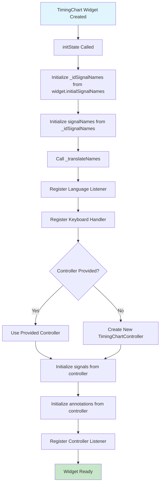
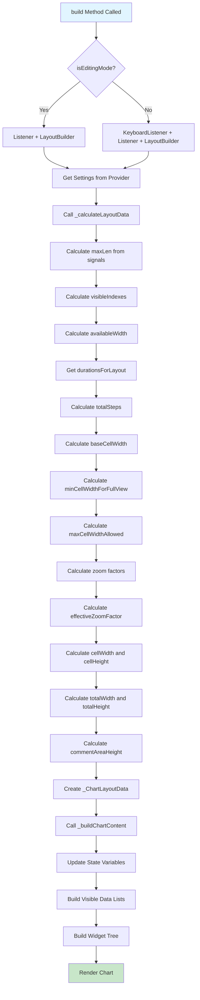
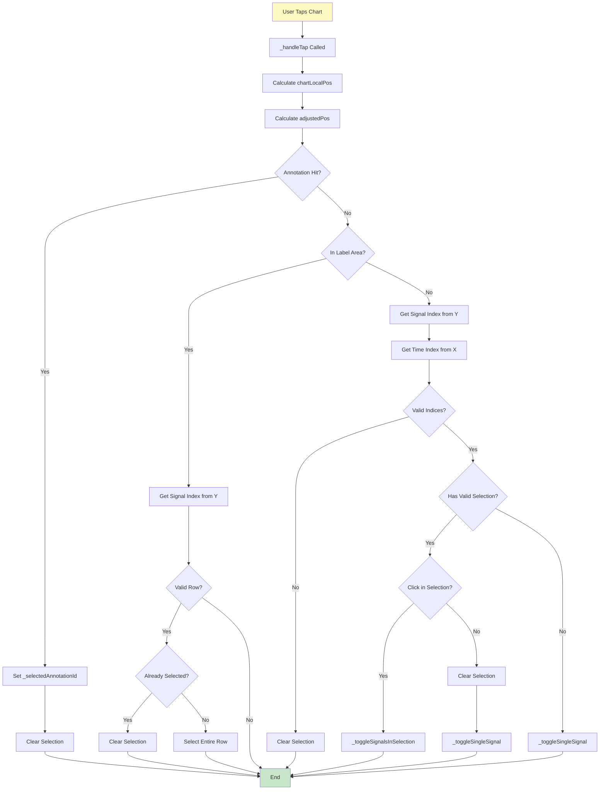
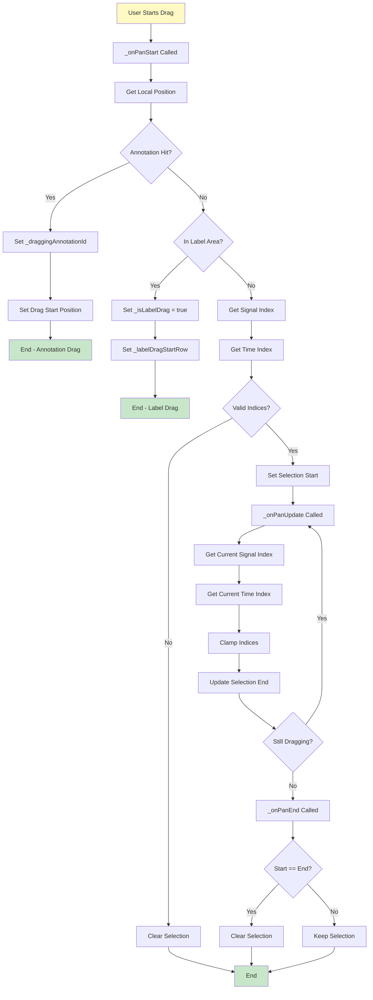
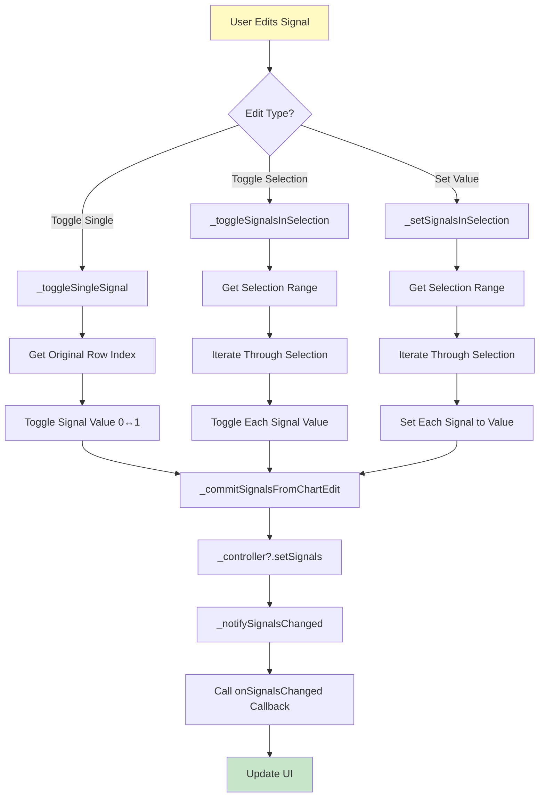
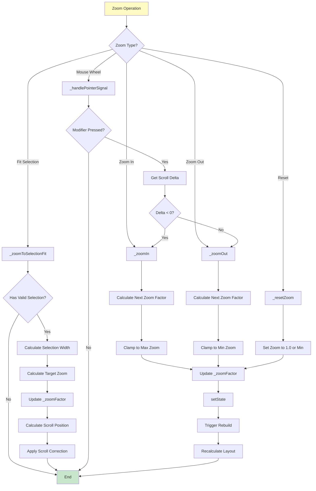
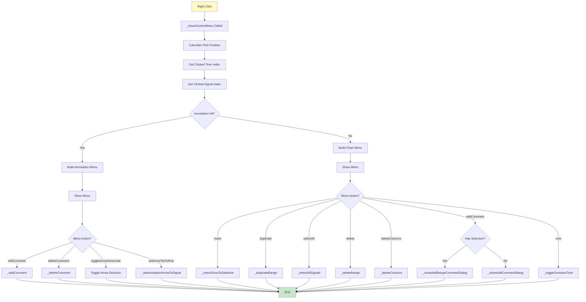
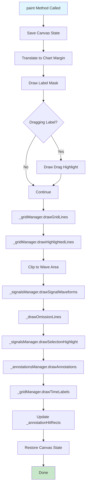
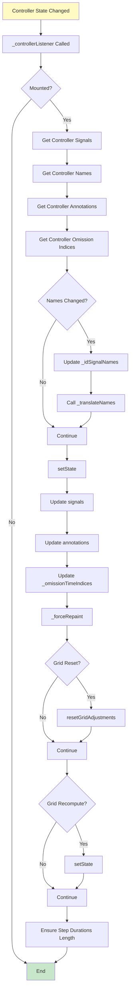
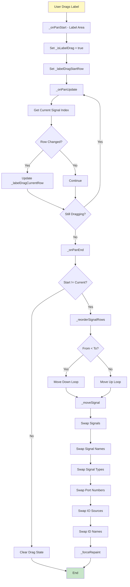

# TimingChart 処理フローチャート

このドキュメントは `timing_chart.dart` の主要な処理フローをフローチャートで説明します。

## 1. ウィジェット初期化フロー

## 2. ビルド・レイアウト計算フロー

## 3. ユーザータップ処理フロー

## 4. ドラッグ処理フロー（選択範囲作成）

## 5. 信号編集フロー

## 6. ズーム操作フロー

## 7. コンテキストメニュー処理フロー

## 8. レンダリングフロー（CustomPainter）

## 9. コントローラー更新フロー

## 10. 信号行の並び替えフロー

## 凡例

- **青い背景**: 開始ノード
- **緑の背景**: 終了ノード
- **黄色の背景**: ユーザーアクション
- **ひし形**: 条件分岐
- **四角形**: 処理ステップ

## 主要な処理の説明

### 初期化
ウィジェット作成時に信号データ、アノテーション、コントローラーを初期化し、リスナーを登録します。

### レイアウト計算
制約と設定に基づいて、セルサイズ、ズーム係数、可視インデックスなどを計算します。

### ユーザーインタラクション
タップ、ドラッグ、ズームなどの操作を処理し、選択範囲の作成や信号の編集を行います。

### レンダリング
CustomPainterを使用して、グリッド、信号波形、アノテーション、選択範囲などを描画します。

### コントローラー更新
外部からのデータ変更を検知し、状態を更新してUIを再描画します。

