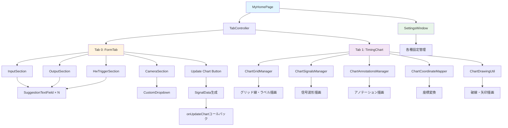
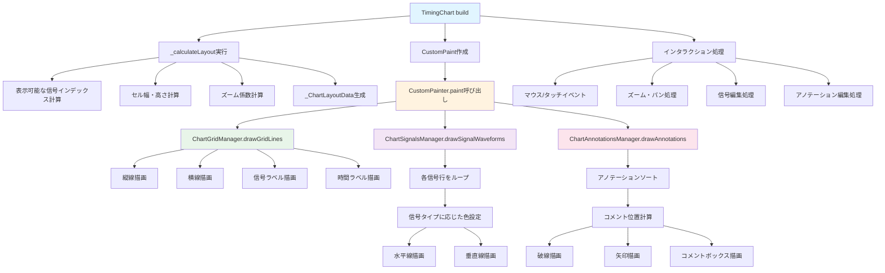
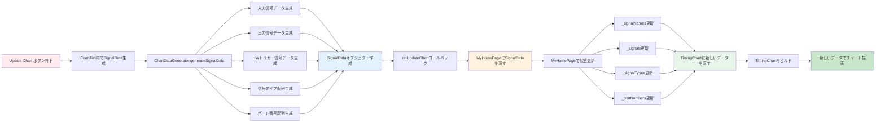
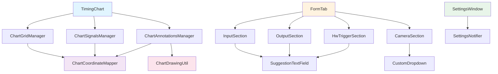

# lib/widgets フォルダ内ファイルのフローチャート

このドキュメントは `lib/widgets` フォルダ内のウィジェットファイルの構造とデータフローを説明します。

> **注意**: 詳細なデータフローは `widgets_flowcharts/` フォルダ内の個別ファイルで管理されています。
> 各フォルダごとの詳細なフローは以下のリンクを参照してください：
> - [widgets_flowcharts/README.md](widgets_flowcharts/README.md) - 全体のインデックス
> - [widgets_flowcharts/chart/](widgets_flowcharts/chart/) - タイミングチャート関連
> - [widgets_flowcharts/form/](widgets_flowcharts/form/) - フォーム入力関連
> - [widgets_flowcharts/common/](widgets_flowcharts/common/) - 共通ウィジェット
> - [widgets_flowcharts/settings/](widgets_flowcharts/settings/) - 設定関連
> - [widgets_flowcharts/data_flow/](widgets_flowcharts/data_flow/) - データフローと状態管理

## ディレクトリ構造

```
lib/widgets/
├── chart/          # タイミングチャート関連ウィジェット
│   ├── timing_chart.dart          # メインのチャートウィジェット
│   ├── chart_signals.dart         # 信号波形描画管理
│   ├── chart_grid.dart            # グリッド・ラベル描画管理
│   ├── chart_annotations.dart     # アノテーション描画管理
│   ├── chart_coordinate_mapper.dart # 座標変換ユーティリティ
│   └── chart_drawing_util.dart    # 描画ユーティリティ関数
├── form/           # フォーム入力関連ウィジェット
│   ├── form_tab.dart              # メインのフォームタブ
│   ├── input_section.dart         # 入力信号セクション
│   ├── output_section.dart        # 出力信号セクション
│   ├── hw_trigger_section.dart    # HWトリガーセクション
│   └── camera_section.dart        # カメラ選択セクション
├── common/         # 共通ウィジェット
│   ├── suggestion_text_field.dart # 候補付きテキストフィールド
│   ├── custom_dropdown.dart       # カスタムドロップダウン
│   └── version_info_dialog.dart   # バージョン情報ダイアログ
└── settings/       # 設定関連ウィジェット
    └── settings_window.dart       # 設定ウィンドウ
```

## 1. 全体アーキテクチャフロー

### テキスト形式

```
[main.dart - MyHomePage]
    │
    ├─→ [TabController]
    │   │
    │   ├─→ Tab 0: [FormTab]
    │   │   │
    │   │   ├─→ [InputSection]
    │   │   │   └─→ [SuggestionTextField] × N
    │   │   │
    │   │   ├─→ [OutputSection]
    │   │   │   └─→ [SuggestionTextField] × N
    │   │   │
    │   │   ├─→ [HwTriggerSection]
    │   │   │   └─→ [SuggestionTextField] × N
    │   │   │
    │   │   ├─→ [CameraSection]
    │   │   │   └─→ [CustomDropdown]
    │   │   │
    │   │   └─→ [Update Chart ボタン]
    │   │       └─→ SignalData生成 → onUpdateChart コールバック
    │   │
    │   └─→ Tab 1: [TimingChart]
    │       │
    │       ├─→ [ChartGridManager]
    │       │   └─→ グリッド線・ラベル描画
    │       │
    │       ├─→ [ChartSignalsManager]
    │       │   └─→ 信号波形描画
    │       │
    │       ├─→ [ChartAnnotationsManager]
    │       │   └─→ アノテーション描画
    │       │
    │       ├─→ [ChartCoordinateMapper]
    │       │   └─→ 座標変換
    │       │
    │       └─→ [ChartDrawingUtil]
    │           └─→ 破線・矢印描画ユーティリティ
    │
    └─→ [SettingsWindow] (別ウィンドウ)
        └─→ 各種設定管理
```

### Mermaid図



## 2. FormTab データフロー

```
[FormTab 初期化]
    │
    ├─→ FormStateNotifier から状態取得
    │   ├─→ inputCount
    │   ├─→ outputCount
    │   ├─→ hwPort
    │   ├─→ triggerOption
    │   └─→ cameraCount
    │
    ├─→ FormControllersNotifier からコントローラー取得
    │   ├─→ inputControllers[]
    │   ├─→ outputControllers[]
    │   └─→ hwTriggerControllers[]
    │
    └─→ 各セクションにデータを渡す
        │
        ├─→ [InputSection]
        │   ├─→ controllers: inputControllers
        │   ├─→ count: inputCount
        │   ├─→ triggerOption: triggerOption
        │   └─→ 各入力フィールドに SuggestionTextField を配置
        │
        ├─→ [OutputSection]
        │   ├─→ controllers: outputControllers
        │   ├─→ count: outputCount
        │   └─→ 各出力フィールドに SuggestionTextField を配置
        │
        ├─→ [HwTriggerSection]
        │   ├─→ controllers: hwTriggerControllers
        │   ├─→ count: hwPort
        │   └─→ 各HWトリガーフィールドに SuggestionTextField を配置
        │
        └─→ [CameraSection]
            ├─→ selectedCamera: cameraCount
            └─→ CustomDropdown でカメラ選択
```

## 3. TimingChart レンダリングフロー

### テキスト形式

```
[TimingChart build()]
    │
    ├─→ _calculateLayout() 実行
    │   ├─→ 表示可能な信号インデックスを計算
    │   ├─→ セル幅・高さを計算
    │   ├─→ ズーム係数を計算
    │   └─→ _ChartLayoutData を生成
    │
    ├─→ CustomPaint ウィジェット作成
    │   │
    │   └─→ [CustomPainter.paint()] 呼び出し
    │       │
    │       ├─→ [ChartGridManager.drawGridLines()]
    │       │   ├─→ 縦線（時間軸）を描画
    │       │   ├─→ 横線（信号行）を描画
    │       │   ├─→ 信号ラベルを描画
    │       │   └─→ 時間ラベルを描画
    │       │
    │       ├─→ [ChartSignalsManager.drawSignalWaveforms()]
    │       │   ├─→ 各信号行をループ
    │       │   ├─→ 信号タイプに応じた色を設定
    │       │   ├─→ 水平線を描画（High/Low）
    │       │   └─→ 垂直線を描画（遷移）
    │       │
    │       └─→ [ChartAnnotationsManager.drawAnnotations()]
    │           ├─→ アノテーションをソート
    │           ├─→ コメントボックス位置を計算（衝突回避）
    │           ├─→ 破線を描画（ChartDrawingUtil.drawDashedLine）
    │           ├─→ 矢印を描画（ChartDrawingUtil.drawArrowLine）
    │           └─→ コメントボックスを描画
    │
    └─→ インタラクション処理
        ├─→ マウス/タッチイベント処理
        ├─→ ズーム・パン処理
        ├─→ 信号編集処理
        └─→ アノテーション編集処理
```

### Mermaid図



## 4. SuggestionTextField フロー

```
[SuggestionTextField 作成]
    │
    ├─→ initState()
    │   ├─→ _updateSuggestions() 呼び出し
    │   │   └─→ widget.loadSuggestions() 実行
    │   │       └─→ 候補リストを非同期取得
    │   │
    │   ├─→ _internalController 作成
    │   │   └─→ widget.controller.text をラベルに変換
    │   │
    │   ├─→ widget.controller のリスナー登録
    │   │   └─→ _onExternalControllerChanged()
    │   │
    │   └─→ 言語変更リスナー登録
    │       └─→ suggestionLanguageVersion.addListener()
    │
    ├─→ build()
    │   ├─→ TextField ウィジェット作成
    │   ├─→ 入力変更時に _onFieldChanged() 呼び出し
    │   │   └─→ IDに変換して widget.controller に設定
    │   │
    │   └─→ フォーカス時に候補リスト表示
    │       └─→ FutureBuilder で候補を表示
    │
    └─→ 言語変更時
        └─→ _updateSuggestions(translateCurrent: true)
            └─→ 現在のテキストを新しい言語で翻訳
```

## 5. Chart コンポーネント間の依存関係

```
[TimingChart]
    │
    ├─→ 使用するマネージャークラス
    │   ├─→ ChartGridManager
    │   │   ├─→ ChartCoordinateMapper (間接的)
    │   │   └─→ 信号名・タイプ・ポート番号を受け取る
    │   │
    │   ├─→ ChartSignalsManager
    │   │   ├─→ ChartCoordinateMapper (間接的)
    │   │   └─→ 信号データ・タイプ・色設定を受け取る
    │   │
    │   └─→ ChartAnnotationsManager
    │       ├─→ ChartCoordinateMapper (間接的)
    │       ├─→ ChartDrawingUtil
    │       │   ├─→ drawDashedLine()
    │       │   ├─→ drawArrowLine()
    │       │   └─→ drawCommentBox()
    │       └─→ アノテーションデータを受け取る
    │
    └─→ 座標変換
        └─→ ChartCoordinateMapper
            └─→ 時間 ↔ X座標変換
            └─→ 信号インデックス ↔ Y座標変換
```

## 6. FormTab → TimingChart データ更新フロー

### テキスト形式

```
[Update Chart ボタン押下]
    │
    ├─→ FormTab 内で SignalData 生成
    │   ├─→ ChartDataGenerator.generateSignalData() 呼び出し
    │   │   ├─→ 入力信号データ生成
    │   │   ├─→ 出力信号データ生成
    │   │   ├─→ HWトリガー信号データ生成
    │   │   ├─→ 信号タイプ配列生成
    │   │   └─→ ポート番号配列生成
    │   │
    │   └─→ SignalData オブジェクト作成
    │       ├─→ signalNames: List<String>
    │       ├─→ signals: List<List<int>>
    │       ├─→ signalTypes: List<SignalType>
    │       └─→ portNumbers: List<int>
    │
    ├─→ onUpdateChart コールバック呼び出し
    │   └─→ MyHomePage に SignalData を渡す
    │
    ├─→ MyHomePage で状態更新
    │   ├─→ _signalNames 更新
    │   ├─→ _signals 更新
    │   ├─→ _signalTypes 更新
    │   └─→ _portNumbers 更新
    │
    └─→ TimingChart に新しいデータを渡す
        ├─→ initialSignalNames 更新
        ├─→ initialSignals 更新
        ├─→ signalTypes 更新
        └─→ portNumbers 更新
            │
            └─→ TimingChart が再ビルド
                └─→ 新しいデータでチャートを描画
```

### Mermaid図



## 7. SettingsWindow フロー

```
[SettingsWindow 表示]
    │
    ├─→ NavigationRail でカテゴリ選択
    │   ├─→ 0: 一般設定
    │   ├─→ 1: チャート設定
    │   ├─→ 2: 入出力設定
    │   ├─→ 3: 外観設定
    │   └─→ 4: 言語設定
    │
    ├─→ SettingsNotifier から設定を取得
    │   ├─→ showGridLines
    │   ├─→ defaultChartLength
    │   ├─→ signalColors
    │   ├─→ commentDashedColor
    │   ├─→ commentArrowColor
    │   ├─→ darkMode
    │   └─→ accentColor
    │
    └─→ 設定変更時
        ├─→ SettingsNotifier のプロパティを更新
        └─→ 変更が TimingChart に反映
            └─→ Provider.watch() により自動更新
```

## 8. 各ウィジェットの主要メソッド

### TimingChart
- `build()`: ウィジェットツリー構築
- `_calculateLayout()`: レイアウト計算
- `_handlePanUpdate()`: パン処理
- `_handleScaleUpdate()`: ズーム処理
- `_handleTap()`: タップ処理（信号編集）

### ChartGridManager
- `drawGridLines()`: グリッド線描画
- `drawLabels()`: ラベル描画

### ChartSignalsManager
- `drawSignalWaveforms()`: 信号波形描画

### ChartAnnotationsManager
- `drawAnnotations()`: アノテーション描画
- `_sortAnnotations()`: アノテーションソート
- `_calculateCommentPosition()`: コメント位置計算

### FormTab
- `build()`: フォームUI構築
- `_buildInputSection()`: 入力セクション構築
- `_buildOutputSection()`: 出力セクション構築
- `_onUpdateChart()`: チャート更新処理

### SuggestionTextField
- `_updateSuggestions()`: 候補リスト更新
- `_idToLabel()`: ID → ラベル変換
- `_labelToId()`: ラベル → ID変換

## 9. データの流れまとめ

```
[ユーザー入力]
    │
    └─→ SuggestionTextField
        └─→ TextEditingController
            │
            └─→ FormTab
                └─→ Update Chart ボタン
                    │
                    └─→ SignalData 生成
                        │
                        └─→ MyHomePage
                            │
                            └─→ TimingChart
                                │
                                ├─→ ChartGridManager
                                │   └─→ グリッド描画
                                │
                                ├─→ ChartSignalsManager
                                │   └─→ 信号波形描画
                                │
                                └─→ ChartAnnotationsManager
                                    └─→ アノテーション描画
```

## 10. 主要な依存関係

### テキスト形式

```
TimingChart
├─→ ChartGridManager
│   └─→ ChartCoordinateMapper (座標変換)
├─→ ChartSignalsManager
│   └─→ ChartCoordinateMapper (座標変換)
└─→ ChartAnnotationsManager
    ├─→ ChartCoordinateMapper (座標変換)
    └─→ ChartDrawingUtil (描画ユーティリティ)

FormTab
├─→ InputSection
│   └─→ SuggestionTextField
├─→ OutputSection
│   └─→ SuggestionTextField
├─→ HwTriggerSection
│   └─→ SuggestionTextField
└─→ CameraSection
    └─→ CustomDropdown

SettingsWindow
└─→ SettingsNotifier (Provider経由)
```

### Mermaid図



## 11. 状態管理の流れ

```
[Provider 階層]
    │
    ├─→ FormStateNotifier
    │   └─→ フォーム状態（ポート数、トリガーオプションなど）
    │
    ├─→ FormControllersNotifier
    │   └─→ TextEditingController の管理
    │
    ├─→ SettingsNotifier
    │   └─→ アプリ設定（色、グリッド表示など）
    │
    ├─→ LocaleNotifier
    │   └─→ 言語設定
    │
    └─→ TimingChartController
        └─→ チャート状態（アンドゥ/リドゥ、アノテーションなど）
```

## 12. イベント処理フロー

```
[ユーザー操作]
    │
    ├─→ フォーム入力
    │   └─→ SuggestionTextField.onChanged
    │       └─→ TextEditingController.text 更新
    │
    ├─→ Update Chart ボタン
    │   └─→ FormTab._onUpdateChart()
    │       └─→ SignalData 生成 → onUpdateChart コールバック
    │
    ├─→ チャート操作
    │   ├─→ パン → TimingChart._handlePanUpdate()
    │   ├─→ ズーム → TimingChart._handleScaleUpdate()
    │   ├─→ タップ → TimingChart._handleTap()
    │   └─→ 信号編集 → TimingChart._toggleSignalValue()
    │
    └─→ 設定変更
        └─→ SettingsWindow → SettingsNotifier 更新
            └─→ Provider.watch() により自動反映
```

