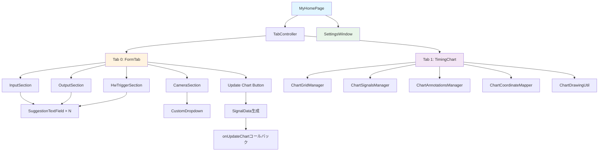

# lib/widgets データフロー ドキュメント

このディレクトリには、`lib/widgets` フォルダ内の各ウィジェットのデータフローと処理フローがフォルダごとに整理されています。

## ディレクトリ構造

```
widgets_flowcharts/
├── README.md                    # このファイル（全体のインデックス）
├── chart/                       # タイミングチャート関連ウィジェット
│   ├── README.md
│   ├── timing_chart.md
│   ├── chart_signals.md
│   ├── chart_grid.md
│   ├── chart_annotations.md
│   ├── coordinate_mapper.md
│   └── drawing_util.md
├── form/                        # フォーム入力関連ウィジェット
│   ├── README.md
│   ├── form_tab.md
│   ├── input_section.md
│   ├── output_section.md
│   ├── hw_trigger_section.md
│   └── camera_section.md
├── common/                      # 共通ウィジェット
│   ├── README.md
│   ├── suggestion_text_field.md
│   ├── custom_dropdown.md
│   └── version_info_dialog.md
├── settings/                     # 設定関連ウィジェット
│   ├── README.md
│   └── settings_window.md
└── data_flow/                   # データフローと状態管理
    ├── README.md
    ├── form_to_chart.md
    ├── state_management.md
    └── event_handling.md
```

## 全体アーキテクチャ



## 各フォルダの説明

### [chart/](chart/) - タイミングチャート関連
タイミングチャートの描画と管理に関するウィジェットのフローを説明します。
- `TimingChart`: メインのチャートウィジェット
- `ChartSignalsManager`: 信号波形の描画
- `ChartGridManager`: グリッドとラベルの描画
- `ChartAnnotationsManager`: アノテーションの描画

### [form/](form/) - フォーム入力関連
フォーム入力画面のウィジェットのフローを説明します。
- `FormTab`: メインのフォームタブ
- `InputSection`: 入力信号セクション
- `OutputSection`: 出力信号セクション
- `HwTriggerSection`: HWトリガーセクション

### [common/](common/) - 共通ウィジェット
複数の場所で使用される共通ウィジェットのフローを説明します。
- `SuggestionTextField`: 候補付きテキストフィールド
- `CustomDropdown`: カスタムドロップダウン
- `VersionInfoDialog`: バージョン情報ダイアログ

### [settings/](settings/) - 設定関連
設定ウィンドウのウィジェットのフローを説明します。
- `SettingsWindow`: 設定ウィンドウ

### [data_flow/](data_flow/) - データフローと状態管理
ウィジェット間のデータフローと状態管理の仕組みを説明します。
- `form_to_chart.md`: FormTabからTimingChartへのデータ更新フロー
- `state_management.md`: Providerを使った状態管理
- `event_handling.md`: イベント処理のフロー

## 関連ドキュメント

- [MAIN_FLOWCHART.md](../MAIN_FLOWCHART.md) - main.dartの処理フロー
- [TIMING_CHART_FLOWCHARTS.md](../TIMING_CHART_FLOWCHARTS.md) - TimingChartの詳細フロー

