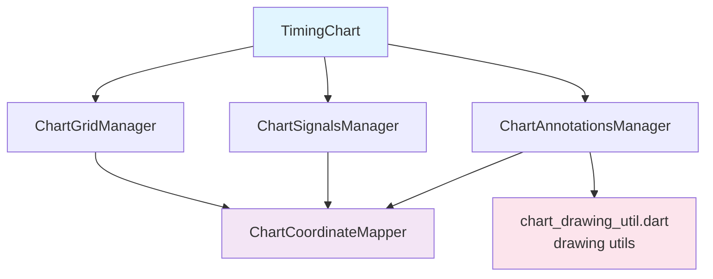

# chart/ フォルダ - タイミングチャート関連ウィジェット

このフォルダには、タイミングチャートの描画と管理に関するウィジェットのデータフローが含まれています。

## ファイル一覧

- [timing_chart.md](timing_chart.md) - TimingChartウィジェットの詳細フロー
- [chart_signals.md](chart_signals.md) - ChartSignalsManagerの信号波形描画フロー
- [chart_grid.md](chart_grid.md) - ChartGridManagerのグリッド・ラベル描画フロー
- [chart_annotations.md](chart_annotations.md) - ChartAnnotationsManagerのアノテーション描画フロー
- [coordinate_mapper.md](coordinate_mapper.md) - ChartCoordinateMapperの座標変換機能
- [drawing_util.md](drawing_util.md) - `chart_drawing_util.dart` の描画ユーティリティ関数（破線/矢印/コメントボックス等）

## 全体構造

## 主要なクラス

### TimingChart
メインのチャートウィジェット。レイアウト計算、描画、インタラクション処理を統合管理します。

### ChartGridManager
グリッド線とラベルの描画を担当します。

### ChartSignalsManager
信号波形の描画を担当します。

### ChartAnnotationsManager
アノテーション（コメント）の描画を担当します。

### ChartCoordinateMapper
論理座標（時間、信号インデックス）と物理座標（ピクセル）の変換を担当します。

### 描画ユーティリティ（`chart_drawing_util.dart`）
破線、矢印、コメントボックスなどの描画ユーティリティ関数を提供します。
（`lib/widgets/chart/chart_drawing_util.dart` のトップレベル関数群です）

