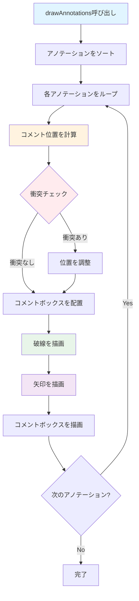

# ChartAnnotationsManager フロー

`ChartAnnotationsManager` は、アノテーション（コメント）の管理とレンダリングを担当するクラスです。

## 主要な機能

- アノテーションの描画
- コメントボックスの位置計算（衝突回避）
- 破線と矢印の描画
- アノテーションのソート
- 当たり判定用の矩形情報を保持（`annotationRects`）
- 下部時間ラベル表示時の被り回避（`showBottomUnitLabels`）

## 描画フロー

## 主要メソッド

### drawAnnotations()
アノテーションを描画します。

**処理の流れ:**
1. アノテーションをソート（開始時間、終了時間の順）
2. 各アノテーションをループ
3. コメントボックスの位置を計算
4. 衝突チェックと位置調整
5. 破線を描画（コメントから信号への破線）
6. 矢印を描画（時間範囲を示す矢印）
7. コメントボックスを描画

### _sortAnnotations()
アノテーションをソートします。
- 開始時間の昇順
- 開始時間が同じ場合は終了時間の昇順

### _calculateCommentPosition()
コメントボックスの位置を計算します。
- 衝突回避アルゴリズムを使用
- 既に配置されたコメントボックスとの重複を避ける

## パラメータ

### コンストラクタパラメータ
- `annotations`: アノテーションのリスト
- `cellWidth`: セル幅
- `cellHeight`: セル高さ
- `labelWidth`: ラベル領域の幅
- `highlightTimeIndices`: ハイライトする時間インデックス
- `selectedAnnotationId`: 選択中のアノテーションID
- `dashedColor`: 破線の色
- `arrowColor`: 矢印の色
- `showBottomUnitLabels`: 下部時間ラベル（単位）表示時に、コメント/矢印の配置を下へ逃がす
- `timeUnitIsMs`: 時間単位がミリ秒かどうか
- `msPerStep`: 1ステップあたりのミリ秒
- `stepDurationsMs`: 各ステップの継続時間（ミリ秒）の配列

## 描画の詳細

### 破線
- コメントボックスから信号行への破線
- `chart_drawing_util.dart` の `drawDashedLine()` を使用

### 矢印
- 時間範囲を示す矢印
- 開始位置と終了位置を結ぶ矢印
- `chart_drawing_util.dart` の `drawArrowLine()` / `drawArrow()` を使用

### コメントボックス
- テキストを含む矩形
- 選択中のアノテーションは強調表示
- `chart_drawing_util.dart` の `drawCommentBox()` を使用

## 衝突回避アルゴリズム

1. 初期位置を計算（時間範囲の中央、チャート下部）
2. 既に配置されたコメントボックスとの重複をチェック
3. 重複がある場合、Y座標を上に移動
4. 画面外に出ないように制限

## 関連ファイル

- `lib/widgets/chart/chart_annotations.dart` - 実装ファイル
- [timing_chart.md](timing_chart.md) - TimingChartの詳細
- [drawing_util.md](drawing_util.md) - 描画ユーティリティの詳細

