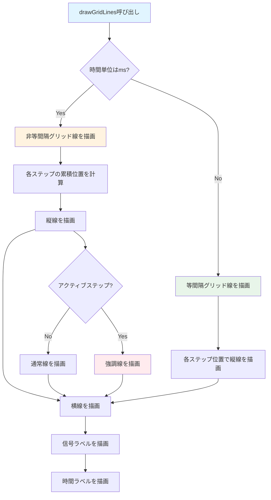

# ChartGridManager フロー

`ChartGridManager` は、グリッド線とラベルの描画を管理するクラスです。

## 主要な機能

- グリッド線の描画（縦線・横線）
- 信号ラベルの描画
- 時間ラベルの描画
- IO番号の表示制御
- 非等間隔時間単位（ミリ秒）のサポート

## 描画フロー

## 主要メソッド

### drawGridLines()
グリッド線を描画します。

**処理の流れ:**
1. 時間単位を確認
   - ミリ秒の場合: 非等間隔グリッド線を描画
   - ステップの場合: 等間隔グリッド線を描画
2. 縦線（時間軸）を描画
3. 横線（信号行）を描画
4. 信号ラベルを描画
5. 時間ラベルを描画

### drawLabels()
ラベルを描画します。

**処理の流れ:**
1. 信号ラベルを描画
   - 信号名を表示
   - IO番号を表示（`showIoNumbers`がtrueの場合）
   - ポート番号を表示
2. 時間ラベルを描画
   - 上部に時間ラベル
   - 下部に単位ラベル（`showBottomUnitLabels`がtrueの場合）

## パラメータ

### コンストラクタパラメータ
- `cellWidth`: セル幅
- `cellHeight`: セル高さ
- `labelWidth`: ラベル領域の幅
- `signalNames`: 信号名のリスト
- `signalTypes`: 信号タイプのリスト
- `showIoNumbers`: IO番号を表示するかどうか
- `portNumbers`: ポート番号のリスト
- `timeUnitIsMs`: 時間単位がミリ秒かどうか
- `msPerStep`: 1ステップあたりのミリ秒
- `stepDurationsMs`: 各ステップの継続時間（ミリ秒）の配列
- `activeStepIndex`: 編集中に強調表示するステップ境界インデックス

## 描画の詳細

### グリッド線
- 縦線: 時間ステップの境界
- 横線: 信号行の境界
- アクティブステップ: オレンジ色の強調線（`activeStepIndex`が設定されている場合）

### ラベル
- 信号ラベル: 左側に表示
  - 信号名
  - IO番号（オプション）
  - ポート番号
- 時間ラベル: 上部と下部に表示
  - 上部: 時間値
  - 下部: 単位（ms/step）

## 関連ファイル

- `lib/widgets/chart/chart_grid.dart` - 実装ファイル
- [timing_chart.md](timing_chart.md) - TimingChartの詳細

