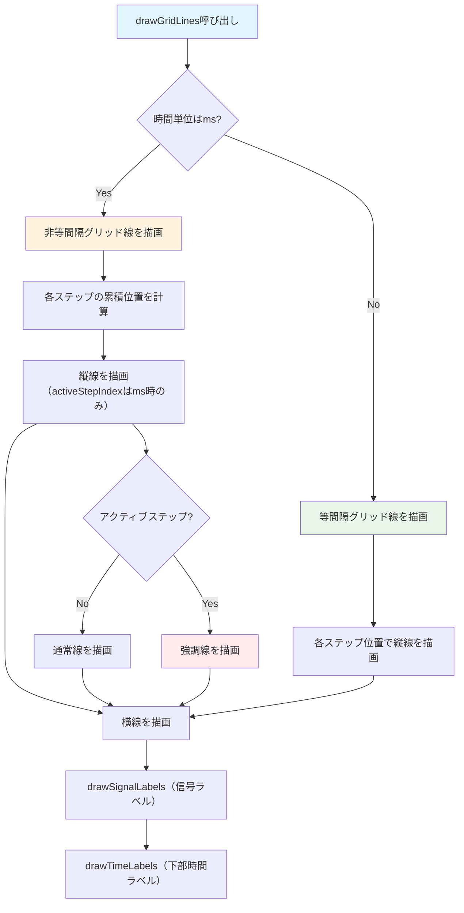

# ChartGridManager フロー

`ChartGridManager` は、グリッド線とラベルの描画を管理するクラスです。

## 主要な機能

- グリッド線の描画（縦線・横線）
- 信号ラベルの描画
- 時間ラベル（下部）の描画（任意）
- IO番号の表示制御
- 非等間隔時間単位（ミリ秒）のサポート
- 信号タイプ（Control/Group/Task）の表示/非表示（`showAllSignalTypes`）
- 選択範囲に応じたラベルのハイライト（`highlightStartRow`/`highlightEndRow`）

## 描画フロー

## 主要メソッド

### drawGridLines()
グリッド線を描画します。

**処理の流れ:**
1. 時間単位を確認
   - ミリ秒の場合: 非等間隔グリッド線を描画
   - ステップの場合: 等間隔グリッド線を描画
2. 縦線（時間軸）を描画
   - step 表記（等間隔）の場合は強調線は描かない
   - ms 表記（非等間隔）の場合は `activeStepIndex` を境界線として強調表示可能
3. 横線（信号行）を描画
4. 信号ラベルを描画
5. 下部時間ラベルを描画（`showBottomUnitLabels` が true の場合）

### drawSignalLabels()
信号名ラベルを描画します。

**処理の流れ:**
1. 信号ラベルを描画
   - 信号名を表示
   - IO番号を表示（`showIoNumbers`がtrueの場合）
   - `portNumbers` やラベル文字列（例: `PLO1:...`）からポート番号を解釈して表示

### drawTimeLabels()
下部の時間軸ラベルを描画します（`showBottomUnitLabels` が false の場合は何もしません）。
- step 表記: `cellWidth` に応じて概ね 80px ごとにラベルを間引き表示
- ms 表記: `stepDurationsMs` を累積し、概ね 80px 以上の間隔でラベルを配置

## パラメータ

### コンストラクタパラメータ
- `cellWidth`: セル幅
- `cellHeight`: セル高さ
- `labelWidth`: ラベル領域の幅
- `signalNames`: 信号名のリスト
- `signalTypes`: 信号タイプのリスト
- `showAllSignalTypes`: Control/Group/Task を含めて表示するか
- `showIoNumbers`: IO番号を表示するかどうか
- `portNumbers`: ポート番号のリスト
- `labelColor`: ラベル文字色
- `highlightStartRow` / `highlightEndRow`: 選択範囲（行）がある場合にラベルをハイライト
- `highlightTextColor`: ハイライト時の文字色
- `timeUnitIsMs`: 時間単位がミリ秒かどうか
- `msPerStep`: 1ステップあたりのミリ秒
- `stepDurationsMs`: 各ステップの継続時間（ミリ秒）の配列
- `activeStepIndex`: 編集中に強調表示するステップ境界インデックス
- `showBottomUnitLabels`: 下部時間ラベルを表示するかどうか

## 描画の詳細

### グリッド線
- 縦線: 時間ステップの境界
- 横線: 信号行の境界
- アクティブステップ: オレンジ色の強調線（`timeUnitIsMs` が true かつ `activeStepIndex` が設定されている場合）

### ラベル
- 信号ラベル: 左側に表示
  - 信号名
  - IO番号（オプション）
  - ポート番号
- 時間ラベル: 下部に表示（任意）
  - step: ステップ番号
  - ms: 累積ミリ秒（四捨五入して整数ms表示）

## 関連ファイル

- `lib/widgets/chart/chart_grid.dart` - 実装ファイル
- [timing_chart.md](timing_chart.md) - TimingChartの詳細

