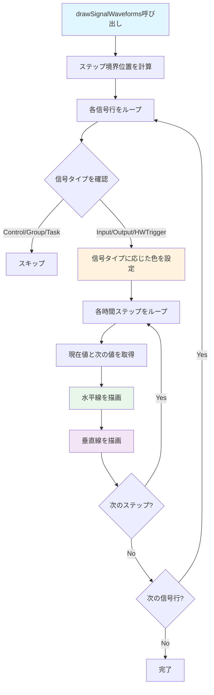

# ChartSignalsManager フロー

`ChartSignalsManager` は、信号波形の描画を管理するクラスです。

## 主要な機能

- 信号波形の描画（High/Lowレベル）
- 信号タイプに応じた色設定
- 非等間隔時間単位（ミリ秒）のサポート

## 描画フロー

## 主要メソッド

### drawSignalWaveforms()
信号波形を描画します。

**処理の流れ:**
1. ステップ境界の累積位置配列を計算（非等間隔時間単位の場合）
2. 各信号行をループ
3. 信号タイプを確認（Control/Group/Taskはスキップ）
4. 信号タイプに応じた色を設定
5. 各時間ステップをループして波形を描画
   - 水平線を描画（High/Lowレベル）
   - 垂直線を描画（遷移）

## パラメータ

### コンストラクタパラメータ
- `cellWidth`: セル幅
- `cellHeight`: セル高さ
- `labelWidth`: ラベル領域の幅
- `signalTypes`: 信号タイプのリスト
- `signalColors`: 信号タイプごとの色マップ
- `timeUnitIsMs`: 時間単位がミリ秒かどうか
- `msPerStep`: 1ステップあたりのミリ秒
- `stepDurationsMs`: 各ステップの継続時間（ミリ秒）の配列

## 描画の詳細

### High/Lowレベルの位置
- `yHigh`: 行上端から25%の位置（Highレベル）
- `yLow`: 行下端から25%の位置（Lowレベル）

### 波形の描画
- 現在値と次の値が同じ場合: 水平線のみ
- 現在値と次の値が異なる場合: 水平線 + 垂直線（遷移）

## 関連ファイル

- `lib/widgets/chart/chart_signals.dart` - 実装ファイル
- [timing_chart.md](timing_chart.md) - TimingChartの詳細

