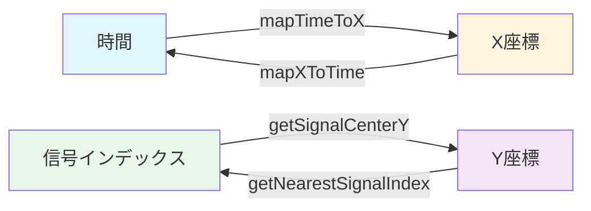

# ChartCoordinateMapper フロー

`ChartCoordinateMapper` は、チャートの座標変換を担当するクラスです。

## 主要な機能

- 時間 ↔ X座標変換
- 信号インデックス ↔ Y座標変換
- グリッド間隔の計算

## 座標変換フロー



## 主要メソッド

### mapTimeToX()
時間をX座標に変換します。

**処理:**
- 時間を0〜1の範囲に正規化
- チャート領域の幅に比例させる
- パディングを考慮

### mapXToTime()
X座標を時間に変換します。

**処理:**
- X座標をチャート領域内での相対位置（0〜1）に変換
- 合計時間に比例させる

### getSignalCenterY()
信号インデックスから中央のY座標を取得します。

### getSignalHighY() / getSignalLowY()
信号インデックスから High/Low レベルのY座標を取得します。
（波形描画の基準位置計算に使用）

### getSignalTopY()
信号インデックスから上端のY座標を取得します。

### getSignalBottomY()
信号インデックスから下端のY座標を取得します。

### getNearestSignalIndex()
Y座標から最も近い信号インデックスを取得します。

**補足:**
- `y < topPadding` の場合は `0`
- `y` が最下端を超える場合は `signalCount - 1` にクリップします

### calculateTimeGridInterval()
時間間隔からグリッド間隔を計算します。

## パラメータ

### コンストラクタパラメータ
- `canvasSize`: キャンバスの全体サイズ
- `totalTime`: 表示する合計時間
- `signalCount`: 信号の数
- `signalHeight`: 各信号の高さ
- `verticalPadding`: 信号間の垂直パディング
- `topPadding`: 上部パディング
- `bottomPadding`: 下部パディング
- `leftPadding`: 左側パディング
- `rightPadding`: 右側パディング

## 計算式

### 時間 → X座標
```
x = leftPadding + (time / totalTime) * chartAreaWidth
```

### X座標 → 時間
```
time = ((x - leftPadding) / chartAreaWidth) * totalTime
```

### 信号インデックス → Y座標（中央）
```
y = topPadding + signalIndex * signalTotalHeight + signalHeight / 2
```

## 関連ファイル

- `lib/widgets/chart/chart_coordinate_mapper.dart` - 実装ファイル
- [timing_chart.md](timing_chart.md) - TimingChartの詳細

