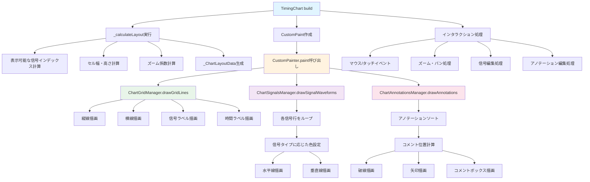

# TimingChart ウィジェット フロー

`TimingChart` は、インタラクティブなタイミング図チャートを表示するStatefulWidgetです。

## 主要な機能

- 時間経過に伴う信号波形の表示
- ズーム、パン、編集機能
- アノテーション（コメント）の追加・編集
- ステップベースとミリ秒ベースの時間単位サポート

## レンダリングフロー

## 主要メソッド

### build()
ウィジェットツリーを構築します。

### _calculateLayout()
レイアウト計算を実行し、`_ChartLayoutData` を生成します。
- 表示可能な信号インデックスの計算
- セル幅・高さの計算
- ズーム係数の計算

### _handlePanUpdate()
パン（ドラッグ）処理を実行します。

### _handleScaleUpdate()
ズーム処理を実行します。

### _handleTap()
タップ処理を実行します（信号編集など）。

### _toggleSignalValue()
信号値をトグルします（0 ↔ 1）。

## データ構造

### _ChartLayoutData
レンダリングに必要な計算済みレイアウト値を保持します。
- `visibleIndexes`: 表示可能な信号行インデックス
- `cellWidth`: セル幅
- `cellHeight`: セル高さ
- `effectiveZoomFactor`: 実効ズーム係数
- `totalWidth`: チャートコンテンツ領域の総幅
- `totalHeight`: チャートコンテンツ領域の総高さ

### _TimePositionCalculator
時間位置計算用のヘルパークラス。
- `calculateStepPositions()`: 累積ステップ位置配列を計算
- `getTimeIndexFromPosition()`: ピクセル位置から時間ステップインデックスを取得

## インタラクション処理

### ズーム
- マウスホイールまたはピンチジェスチャーでズーム
- ズーム係数は `minZoomFactorForView` と `maxZoomFactorForView` の範囲内に制限

### パン
- ドラッグでチャートを移動
- ビューポートの範囲内に制限

### 信号編集
- タップで信号値をトグル（0 ↔ 1）
- アンドゥ/リドゥ機能をサポート

### アノテーション編集
- アノテーションの追加・編集・削除
- ドラッグでアノテーションを移動

## 関連ファイル

- `lib/widgets/chart/timing_chart.dart` - 実装ファイル
- [chart_signals.md](chart_signals.md) - ChartSignalsManagerの詳細
- [chart_grid.md](chart_grid.md) - ChartGridManagerの詳細
- [chart_annotations.md](chart_annotations.md) - ChartAnnotationsManagerの詳細

