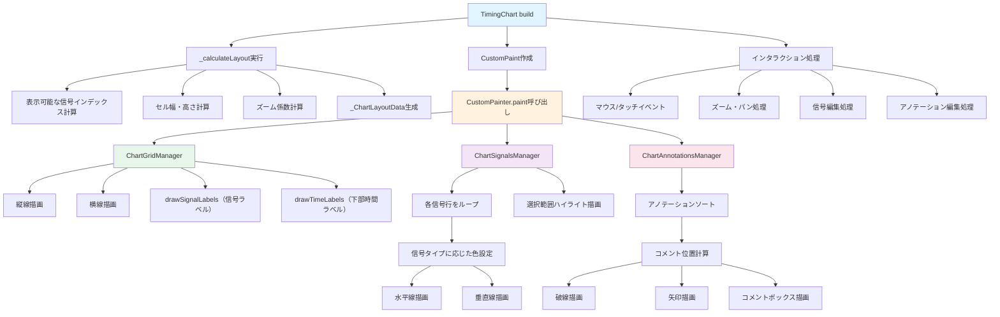

# TimingChart ウィジェット フロー

`TimingChart` は、インタラクティブなタイミング図チャートを表示するStatefulWidgetです。

## 主要な機能

- 時間経過に伴う信号波形の表示
- ズーム、パン、編集機能
- アノテーション（コメント）の追加・編集
- ステップベースとミリ秒ベースの時間単位サポート
- 信号行の並び替え（ラベルドラッグ）
- 選択範囲操作（反転/挿入/削除/複製/省略 など）
- キーボード操作（ショートカット、横スクロール等）

## 実装構成（part ファイル）

`timing_chart.dart` は責務ごとに `part` へ分割されています。

- **`timing_chart_types.dart`**: 内部用型/計算ユーティリティ
- **`timing_chart_auto_comments.dart`**: 自動コメント生成/補助
- **`timing_chart_painters.dart`**: 描画（CustomPainter）と各 Manager の組み立て
- **`timing_chart_export.dart`**: エクスポート/外部連携（取得系APIなど）
- **`timing_chart_selection_ops.dart`**: 選択/編集操作（セル反転、列操作、正規化等）
- **`timing_chart_gestures.dart`**: ジェスチャー（タップ/ドラッグ、アノテーションドラッグ等）
- **`timing_chart_edit_steps.dart`**: ステップ編集モード（境界編集/ハイライト等）
- **`timing_chart_zoom_scroll.dart`**: ズーム/スクロール（アンカー補正、ホイールズーム、キー横スクロール）
- **`timing_chart_keyboard.dart`**: キーボード操作（ショートカット）
- **`timing_chart_row_reorder.dart`**: 行並べ替え（ラベルドラッグによる reorder）

## レンダリングフロー

## 主要メソッド

### build()
ウィジェットツリーを構築します。

### _calculateLayout()
レイアウト計算を実行し、`_ChartLayoutData` を生成します。
- 表示可能な信号インデックスの計算
- セル幅・高さの計算
- ズーム係数の計算

### _onPanUpdate() / _onPanStart() / _onPanEnd()
パン（ドラッグ）処理を実行します。

### _handlePointerSignal()
ズーム/ホイール入力を処理します（**Ctrl/Meta + ホイール**でズーム、アンカー補正あり）。

### _handleTap()
タップ処理を実行します（信号編集など）。

### _toggleSingleSignal() / _toggleSignalsInSelection()
信号値をトグルします（0 ↔ 1）。選択範囲がある場合は範囲内を一括で反転します。

## データ構造

### _ChartLayoutData
レンダリングに必要な計算済みレイアウト値を保持します。
- `visibleIndexes`: 表示可能な信号行インデックス
- `cellWidth`: セル幅
- `cellHeight`: セル高さ
- `effectiveZoomFactor`: 実効ズーム係数
- `totalWidth`: チャートコンテンツ領域の総幅
- `totalHeight`: チャートコンテンツ領域の総高さ

### _TimePositionCalculator
時間位置計算用のヘルパークラス。
- `calculateStepPositions()`: 累積ステップ位置配列を計算
- `getTimeIndexFromPosition()`: ピクセル位置から時間ステップインデックスを取得

## インタラクション処理

### ズーム
- **Ctrl/Meta + マウスホイール**でズーム（アンカー補正あり）
- ボタン操作（ズームイン/アウト/リセット/選択範囲フィット等）も提供
- ズーム係数は `minZoomFactorForView` と `maxZoomFactorForView` の範囲内に制限

### パン
- ドラッグでチャートを移動
- ビューポートの範囲内に制限

### 信号編集
- タップで単一セルをトグル（0 ↔ 1）
- 選択範囲がある場合は範囲内を一括反転
- アンドゥ/リドゥ機能をサポート

### 行の並べ替え
- 左ラベル領域をドラッグして行を並べ替えます（`timing_chart_row_reorder.dart`）

### アノテーション編集
- アノテーションの追加・編集・削除
- ドラッグでアノテーションを移動

## 関連ファイル

- `lib/widgets/chart/timing_chart.dart` - 実装ファイル
- [chart_signals.md](chart_signals.md) - ChartSignalsManagerの詳細
- [chart_grid.md](chart_grid.md) - ChartGridManagerの詳細
- [chart_annotations.md](chart_annotations.md) - ChartAnnotationsManagerの詳細

