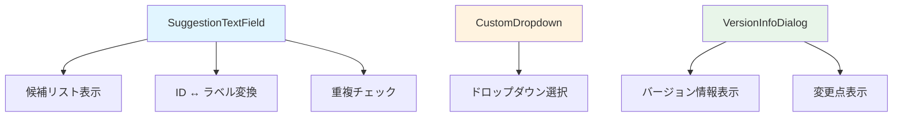

# common/ フォルダ - 共通ウィジェット

このフォルダには、複数の場所で使用される共通ウィジェットのデータフローが含まれています。

## ファイル一覧

- [suggestion_text_field.md](suggestion_text_field.md) - SuggestionTextFieldの詳細フロー
- [custom_dropdown.md](custom_dropdown.md) - CustomDropdownの説明
- [version_info_dialog.md](version_info_dialog.md) - VersionInfoDialogの説明

## 全体構造

## 主要なウィジェット

### SuggestionTextField
候補付きテキストフィールド。入力時に候補リストを表示し、IDとラベルの変換を行います。

### CustomDropdown
カスタムドロップダウン。汎用的なドロップダウン選択を提供します。

### VersionInfoDialog
バージョン情報ダイアログ。アプリのバージョン情報と変更点を表示します。

