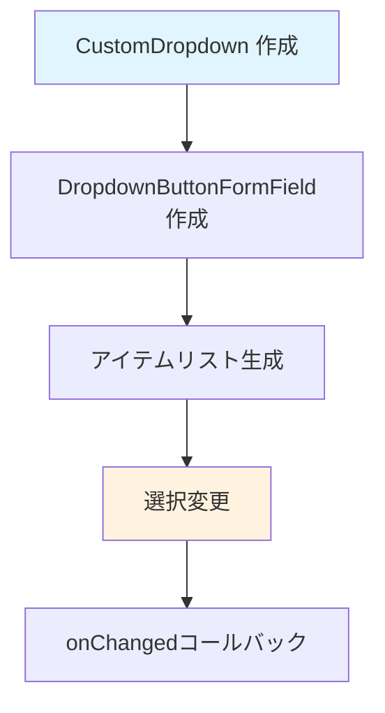

# CustomDropdown ウィジェット フロー

`CustomDropdown` は、汎用的なドロップダウン選択ウィジェットです。

## 主要な機能

- ドロップダウン選択
- カスタマイズ可能なラベル

## データフロー



## 主要メソッド

### build()
ドロップダウンのUIを構築します。

## パラメータ

### コンストラクタパラメータ
- `value`: 現在の値
- `items`: 選択可能なアイテムのリスト
- `onChanged`: 値変更時のコールバック
- `label`: ラベルテキスト

## 使用例

```dart
CustomDropdown<int>(
  value: selectedCamera,
  items: List.generate(4, (index) => index + 1),
  onChanged: onCameraChanged,
  label: 'Camera',
)
```

## 関連ファイル

- `lib/widgets/common/custom_dropdown.dart` - 実装ファイル
- [../form/camera_section.md](../form/camera_section.md) - CameraSectionでの使用例

