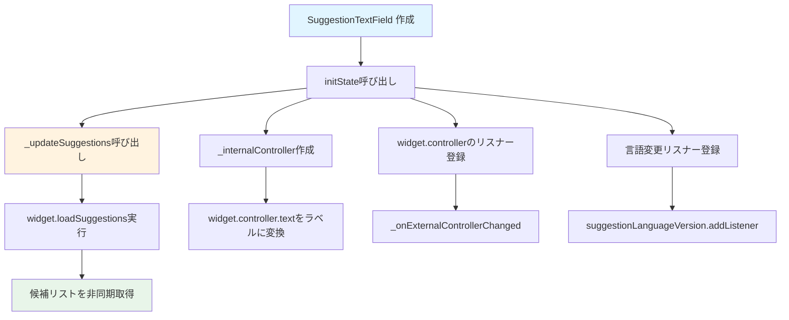
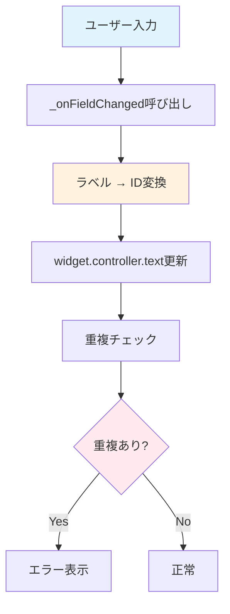

# SuggestionTextField ウィジェット フロー

`SuggestionTextField` は、候補付きテキストフィールドウィジェットです。

## 主要な機能

- 候補リストの表示
- ID ↔ ラベル変換
- 重複チェック
- 言語変更対応

## 初期化フロー

## 入力処理フロー

## 主要メソッド

### initState()
初期化処理を実行します。
- `_updateSuggestions()` を呼び出し
- `_internalController` を作成
- `widget.controller` のリスナーを登録
- 言語変更リスナーを登録

### _updateSuggestions()
候補リストを更新します。
- `widget.loadSuggestions()` を実行
- `translateCurrent` がtrueの場合、現在のテキストを翻訳

### _onExternalControllerChanged()
外部コントローラーの変更を処理します。
- `widget.controller.text` をラベルに変換
- `_internalController.text` を更新

### _onFieldChanged()
フィールドの変更を処理します。
- ラベルをIDに変換
- `widget.controller.text` を更新
- 重複チェックを実行

### _idToLabel()
IDをラベルに変換します。
- 候補リストからIDに対応するラベルを検索

### _labelToId()
ラベルをIDに変換します。
- 候補リストからラベルに対応するIDを検索

## パラメータ

### コンストラクタパラメータ
- `label`: ラベルテキスト
- `controller`: TextEditingController
- `loadSuggestions`: 候補リストを読み込む関数
- `excludeControllers`: 重複チェック用のコントローラーリスト（オプション）
- `enableDuplicateCheck`: 重複チェックを有効にするかどうか

## 言語変更対応

言語が変更されると、`suggestionLanguageVersion` のリスナーが呼び出され、`_updateSuggestions(translateCurrent: true)` が実行されます。これにより、現在のテキストが新しい言語で翻訳されます。

## 重複チェック

`enableDuplicateCheck` がtrueの場合、`excludeControllers` に含まれるコントローラーの値と重複していないかチェックします。

## 関連ファイル

- `lib/widgets/common/suggestion_text_field.dart` - 実装ファイル
- [../form/form_tab.md](../form/form_tab.md) - FormTabでの使用例

