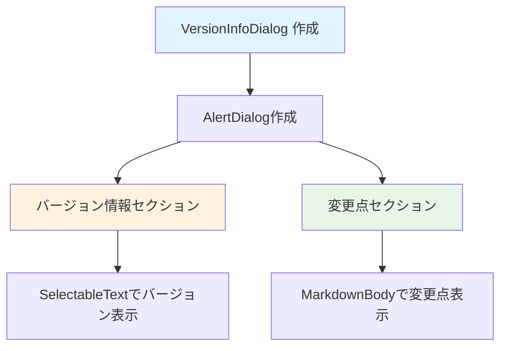

# VersionInfoDialog ウィジェット フロー

`VersionInfoDialog` は、バージョン情報を表示するダイアログウィジェットです。

## 主要な機能

- バージョン情報の表示
- 変更点の表示（Markdown形式）

## データフロー

## 主要メソッド

### build()
ダイアログのUIを構築します。

## パラメータ

### コンストラクタパラメータ
- `title`: ダイアログのタイトル（オプション）
- `version`: バージョン文字列（オプション）
- `changelog`: 変更点のMarkdownテキスト（オプション）

## 表示内容

### バージョン情報セクション
- バージョンラベル
- バージョン文字列（選択可能）

### 変更点セクション
- 変更点ラベル
- Markdown形式の変更点テキスト（スクロール可能）

## 関連ファイル

- `lib/widgets/common/version_info_dialog.dart` - 実装ファイル

