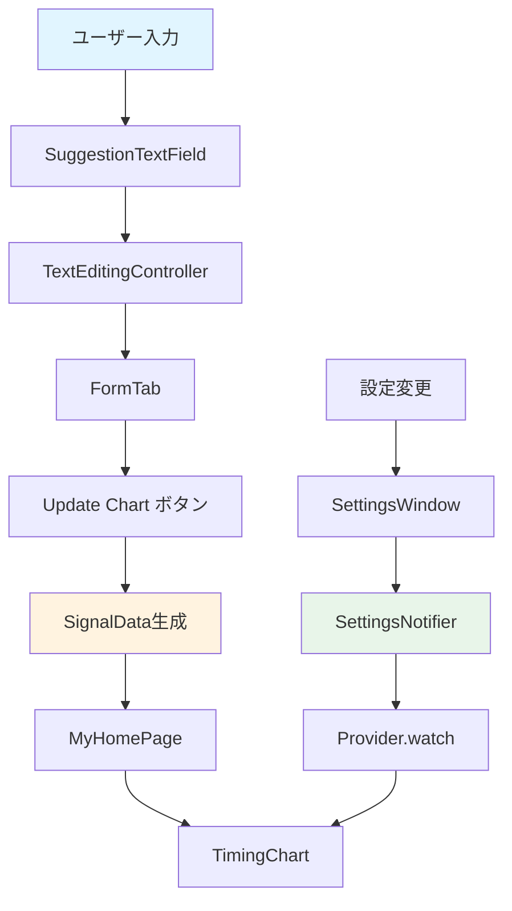

# data_flow/ フォルダ - データフローと状態管理

このフォルダには、ウィジェット間のデータフローと状態管理の仕組みが含まれています。

## ファイル一覧

- [form_to_chart.md](form_to_chart.md) - FormTabからTimingChartへのデータ更新フロー
- [state_management.md](state_management.md) - Providerを使った状態管理
- [event_handling.md](event_handling.md) - イベント処理のフロー

## 全体構造

## データフローの概要

### FormTab → TimingChart
フォーム入力からチャートへのデータ更新フロー。

### 状態管理
Providerを使った状態管理の仕組み。

### イベント処理
ユーザー操作のイベント処理フロー。

