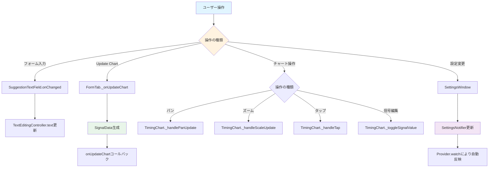
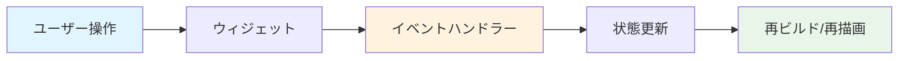

# イベント処理のフロー

このドキュメントは、ユーザー操作のイベント処理フローを説明します。

## イベント処理フロー



## 各イベントの処理

### フォーム入力

**フロー:**
1. ユーザーがテキストフィールドに入力
2. `SuggestionTextField._onFieldChanged()` が呼び出される
3. ラベルをIDに変換
4. `TextEditingController.text` が更新される
5. 重複チェックが実行される（有効な場合）

**コード例:**
```dart
void _onFieldChanged(String value) {
  final id = _labelToId(value);
  widget.controller.text = id;
  // 重複チェック
  if (widget.enableDuplicateCheck) {
    // 重複チェック処理
  }
}
```

### Update Chart ボタン

**フロー:**
1. ユーザーが「Update Chart」ボタンを押す
2. `FormTab._onUpdateChart()` が呼び出される
3. `ChartDataGenerator.generateSignalData()` でSignalDataを生成
4. `onUpdateChart` コールバックが呼び出される
5. `MyHomePage` で状態が更新される
6. `TimingChart` が再ビルドされる

**コード例:**
```dart
void _onUpdateChart() {
  final signalData = ChartDataGenerator.generateSignalData(
    // パラメータ
  );
  widget.onUpdateChart(signalData);
}
```

### チャート操作

#### パン（ドラッグ）

**フロー:**
1. ユーザーがチャート上でドラッグ
2. `TimingChart._handlePanUpdate()` が呼び出される
3. ビューポートのオフセットが更新される
4. チャートが再描画される

**コード例:**
```dart
void _handlePanUpdate(DragUpdateDetails details) {
  setState(() {
    _viewportOffset += details.delta;
    // 範囲チェック
    _clampViewportOffset();
  });
}
```

#### ズーム

**フロー:**
1. ユーザーがマウスホイールまたはピンチジェスチャー
2. `TimingChart._handleScaleUpdate()` が呼び出される
3. ズーム係数が更新される
4. チャートが再描画される

**コード例:**
```dart
void _handleScaleUpdate(ScaleUpdateDetails details) {
  setState(() {
    _zoomFactor *= details.scale;
    // 範囲チェック
    _clampZoomFactor();
  });
}
```

#### タップ

**フロー:**
1. ユーザーがチャート上をタップ
2. `TimingChart._handleTap()` が呼び出される
3. タップ位置から信号インデックスと時間インデックスを取得
4. 信号編集またはアノテーション編集を実行

**コード例:**
```dart
void _handleTap(TapDownDetails details) {
  final signalIndex = _getSignalIndexFromPosition(details.localPosition);
  final timeIndex = _getTimeIndexFromPosition(details.localPosition);
  _toggleSignalValue(signalIndex, timeIndex);
}
```

#### 信号編集

**フロー:**
1. ユーザーが信号セルをタップ
2. `TimingChart._toggleSignalValue()` が呼び出される
3. 信号値がトグルされる（0 ↔ 1）
4. アンドゥスタックに追加される
5. チャートが再描画される

**コード例:**
```dart
void _toggleSignalValue(int signalIndex, int timeIndex) {
  final currentValue = _signals[signalIndex][timeIndex];
  final newValue = currentValue == 0 ? 1 : 0;
  _signals[signalIndex][timeIndex] = newValue;
  _controller?.addUndoState();
  setState(() {});
}
```

### 設定変更

**フロー:**
1. ユーザーが設定を変更
2. `SettingsWindow` で `SettingsNotifier` のプロパティが更新される
3. `notifyListeners()` が呼び出される
4. `Provider.watch()` で監視中のウィジェットが再ビルドされる

**コード例:**
```dart
void _onShowGridLinesChanged(bool value) {
  final settings = context.read<SettingsNotifier>();
  settings.showGridLines = value;
  // notifyListeners() が自動的に呼び出される
}
```

## イベントの伝播



## 関連ファイル

- `lib/widgets/form/form_tab.dart` - FormTabのイベント処理
- `lib/widgets/chart/timing_chart.dart` - TimingChartのイベント処理
- `lib/widgets/settings/settings_window.dart` - SettingsWindowのイベント処理
- [form_to_chart.md](form_to_chart.md) - FormTabからTimingChartへのデータフロー
- [state_management.md](state_management.md) - 状態管理の詳細

