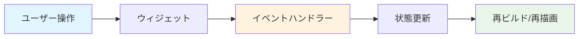

# イベント処理のフロー

このドキュメントは、ユーザー操作のイベント処理フローを説明します。

## イベント処理フロー

```mermaid
flowchart TD
    A[ユーザー操作] --> B{操作の種類}
    
    B -->|フォーム入力| C[SuggestionTextField.onChanged]
    C --> D[TextEditingController.text更新]
    
    B -->|Update Chart| E[FormTab._onUpdateChart]
    E --> F[更新パラメータ生成<br/>(names / values / types / ports / ioSources)]
    F --> G[onUpdateChartコールバック]
    G --> GG[TimingChartGeneratorHomePage]
    GG --> GH[ChartUpdateService.updateChart]
    
    B -->|チャート操作| H{操作の種類}
    H -->|パン| I[TimingChart._onPanUpdate]
    H -->|ズーム| J[TimingChart._handlePointerSignal<br/>(Ctrl/Meta + ホイール)]
    H -->|タップ| K[TimingChart._handleTap]
    H -->|信号編集| L[_toggleSingleSignal / _toggleSignalsInSelection]
    
    B -->|設定変更| M[SettingsWindow]
    M --> N[SettingsNotifier更新]
    N --> O[Provider.watchにより自動反映]
    
    style A fill:#e1f5ff
    style B fill:#fff3e0
    style F fill:#e8f5e9
    style N fill:#f3e5f5
```

## 各イベントの処理

### フォーム入力

**フロー:**
1. ユーザーがテキストフィールドに入力
2. `SuggestionTextField._onFieldChanged()` が呼び出される
3. ラベルをIDに変換
4. `TextEditingController.text` が更新される
5. 重複チェックが実行される（有効な場合）

**コード例:**
```dart
void _onFieldChanged(String value) {
  final id = _labelToId(value);
  widget.controller.text = id;
  // 重複チェック
  if (widget.enableDuplicateCheck) {
    // 重複チェック処理
  }
}
```

### Update Chart ボタン

**フロー:**
1. ユーザーが「Update Chart」ボタンを押す
2. `FormTab._onUpdateChart()` が呼び出される
3. `FormTabState` が `names / values / types / ports / ioSources` を生成（可視信号のみ）
4. `onUpdateChart` コールバックが呼び出される
5. `TimingChartGeneratorHomePage` が `ChartUpdateService.updateChart(...)` で既存値/順序をマージして状態更新
6. `TimingChartController` / `TimingChartState` に反映され、チャートが再描画される

**コード例:**
```dart
void _onUpdateChart() {
  // FormTab 側で生成（可視信号のみ）
  widget.onUpdateChart(
    outNames,
    outChartData,
    outTypes,
    outPorts,
    outIoSources,
    false,
  );
}
```

### チャート操作

#### パン（ドラッグ）

**フロー:**
1. ユーザーがチャート上でドラッグ
2. `TimingChart._onPanUpdate()` が呼び出される
3. ビューポートのオフセットが更新される
4. チャートが再描画される

**コード例:**
```dart
void _onPanUpdate(DragUpdateDetails details) {
  setState(() {
    _viewportOffset += details.delta;
    // 範囲チェック
    _clampViewportOffset();
  });
}
```

#### ズーム

**フロー:**
1. ユーザーがマウスホイールまたはピンチジェスチャー
2. `TimingChart._handlePointerSignal()` が呼び出される（Ctrl/Meta が押されている場合）
3. ズーム係数が更新される
4. チャートが再描画される

**コード例:**
```dart
void _handlePointerSignal(PointerSignalEvent event) {
  // Ctrl/Meta + ホイールでズーム（アンカー補正あり）
}
```

#### タップ

**フロー:**
1. ユーザーがチャート上をタップ
2. `TimingChart._handleTap()` が呼び出される
3. タップ位置から信号インデックスと時間インデックスを取得
4. 信号編集またはアノテーション編集を実行

**コード例:**
```dart
void _handleTap(TapUpDetails details) {
  final signalIndex = _getSignalIndexFromPosition(details.localPosition);
  final timeIndex = _getTimeIndexFromPosition(details.localPosition);
  _toggleSingleSignal(signalIndex, timeIndex);
}
```

#### 信号編集

**フロー:**
1. ユーザーが信号セルをタップ
2. `_toggleSingleSignal()`（または選択範囲があれば `_toggleSignalsInSelection()`）が呼び出される
3. 信号値がトグルされる（0 ↔ 1）
4. アンドゥスタックに追加される
5. チャートが再描画される

**コード例:**
```dart
void _toggleSingleSignal(int visibleRow, int time) {
  // visibleRow/time のセルを 0/1 反転し、コントローラへコミットする
}
```

### 設定変更

**フロー:**
1. ユーザーが設定を変更
2. `SettingsWindow` で `SettingsNotifier` のプロパティが更新される
3. `notifyListeners()` が呼び出される
4. `Provider.watch()` で監視中のウィジェットが再ビルドされる

**コード例:**
```dart
void _onShowGridLinesChanged(bool value) {
  final settings = context.read<SettingsNotifier>();
  settings.showGridLines = value;
  // notifyListeners() が自動的に呼び出される
}
```

## イベントの伝播



## 関連ファイル

- `lib/widgets/form/form_tab.dart` - FormTabのイベント処理
- `lib/widgets/chart/timing_chart.dart` - TimingChartのイベント処理
- `lib/widgets/settings/settings_window.dart` - SettingsWindowのイベント処理
- [form_to_chart.md](form_to_chart.md) - FormTabからTimingChartへのデータフロー
- [state_management.md](state_management.md) - 状態管理の詳細

