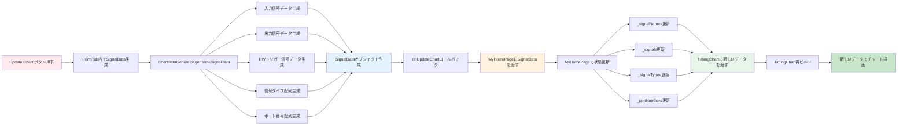

# FormTab → TimingChart データ更新フロー

このドキュメントは、FormTabからTimingChartへのデータ更新フローを説明します。

## データ更新フロー



## 詳細な処理フロー

### 1. Update Chart ボタン押下

ユーザーが「Update Chart」ボタンを押すと、`FormTab._onUpdateChart()` が呼び出されます。

### 2. SignalData 生成

`ChartDataGenerator.generateSignalData()` が呼び出され、以下のデータが生成されます：

- **入力信号データ**: 入力コントローラーから信号名と初期値を取得
- **出力信号データ**: 出力コントローラーから信号名と初期値を取得
- **HWトリガー信号データ**: HWトリガーコントローラーから信号名と初期値を取得
- **信号タイプ配列**: 各信号のタイプ（Input/Output/HWTrigger/Control/Group/Task）
- **ポート番号配列**: 各信号のポート番号

### 3. SignalData オブジェクト作成

生成されたデータから `SignalData` オブジェクトが作成されます：

```dart
SignalData(
  signalNames: List<String>,      // 信号名のリスト
  signals: List<List<int>>,         // 信号値のリスト（各行は時間経過に伴う0/1値のリスト）
  signalTypes: List<SignalType>,    // 信号タイプのリスト
  portNumbers: List<int>,           // ポート番号のリスト
)
```

### 4. onUpdateChart コールバック

`SignalData` オブジェクトが `onUpdateChart` コールバックを通じて `MyHomePage` に渡されます。

### 5. MyHomePage で状態更新

`MyHomePage` で以下の状態が更新されます：

- `_signalNames`: 信号名のリスト
- `_signals`: 信号値のリスト
- `_signalTypes`: 信号タイプのリスト
- `_portNumbers`: ポート番号のリスト

### 6. TimingChart にデータを渡す

更新されたデータが `TimingChart` のプロパティとして渡されます：

- `initialSignalNames`
- `initialSignals`
- `signalTypes`
- `portNumbers`

### 7. TimingChart 再ビルド

`TimingChart` が再ビルドされ、新しいデータでチャートが描画されます。

## データ構造

### SignalData

```dart
class SignalData {
  final List<String> signalNames;
  final List<List<int>> signals;
  final List<SignalType> signalTypes;
  final List<int> portNumbers;
}
```

### 信号値の形式

各信号は時間経過に伴う0/1値のリストとして表現されます：

```dart
signals: [
  [0, 1, 1, 0, 1, ...],  // 信号1の時間経過
  [1, 0, 0, 1, 0, ...],  // 信号2の時間経過
  ...
]
```

## 関連ファイル

- `lib/widgets/form/form_tab.dart` - FormTabの実装
- `lib/widgets/chart/timing_chart.dart` - TimingChartの実装
- `lib/models/chart/chart_data_generator.dart` - SignalData生成ロジック
- [../form/form_tab.md](../form/form_tab.md) - FormTabの詳細
- [../chart/timing_chart.md](../chart/timing_chart.md) - TimingChartの詳細

