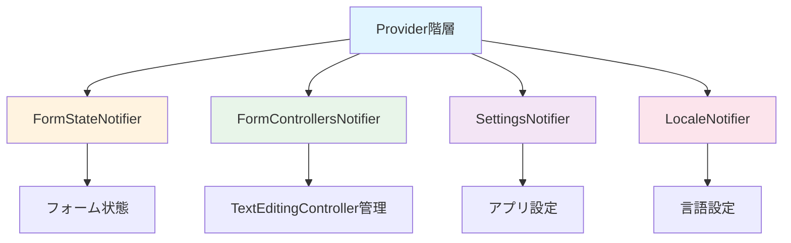
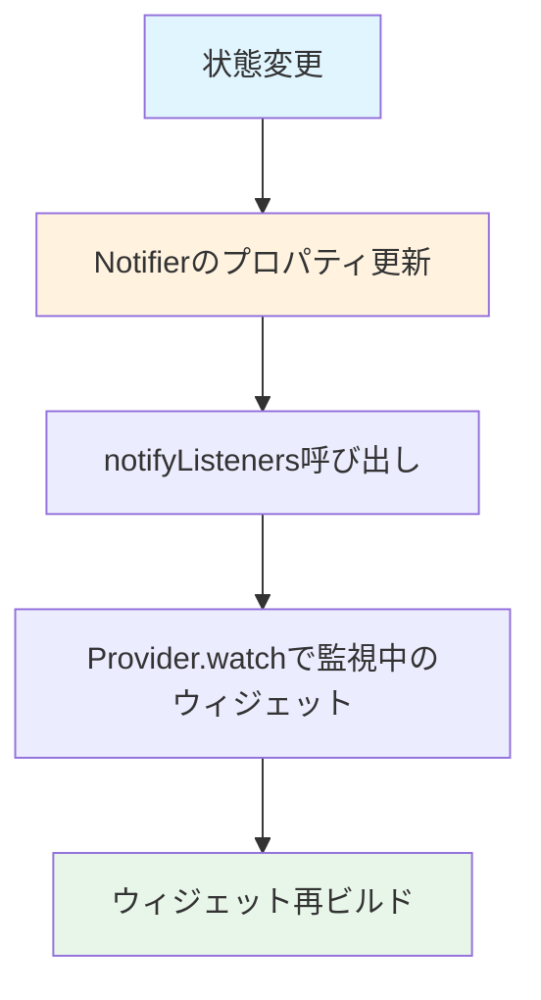

# 状態管理のフロー

このドキュメントは、Providerを使った状態管理の仕組みを説明します。

## Provider 階層



## 各Notifierの役割

### FormStateNotifier
フォーム状態を管理します。

**管理する状態:**
- `inputCount`: 入力ポート数
- `outputCount`: 出力ポート数
- `hwPort`: HWトリガーポート数
- `triggerOption`: トリガーオプション（Single/Code/Command）
- `cameraCount`: カメラ数
- `plcEipMode`: PLC/EIPモード

**使用例:**
```dart
final formState = context.watch<FormStateNotifier>();
final inputCount = formState.inputCount;
```

### FormControllersNotifier
TextEditingControllerの管理を行います。

**管理するコントローラー:**
- `inputControllers`: 入力信号のコントローラーリスト
- `outputControllers`: 出力信号のコントローラーリスト
- `hwTriggerControllers`: HWトリガーのコントローラーリスト

**使用例:**
```dart
final controllers = context.watch<FormControllersNotifier>();
final inputController = controllers.inputControllers[0];
```

### SettingsNotifier
アプリ設定を管理します。

**管理する設定:**
- `showGridLines`: グリッド線の表示
- `defaultChartLength`: デフォルトチャート長
- `signalColors`: 信号タイプごとの色
- `commentDashedColor`: コメント破線の色
- `commentArrowColor`: コメント矢印の色
- `darkMode`: ダークモード
- `accentColor`: アクセントカラー

**使用例:**
```dart
final settings = context.watch<SettingsNotifier>();
final showGrid = settings.showGridLines;
```

### LocaleNotifier
言語設定を管理します。

**管理する状態:**
- `locale`: 現在のロケール（ja/en）

**使用例:**
```dart
final locale = context.watch<LocaleNotifier>();
final currentLocale = locale.locale;
```

### TimingChartController
チャート状態を管理します。

**管理する状態:**
- アンドゥ/リドゥスタック
- アノテーションリスト
- 信号データ

**使用例:**
```dart
final controller = TimingChartController();
controller.addAnnotation(annotation);
```

## 状態更新のフロー



## Provider.watch() の使用

### 状態を監視する

```dart
final settings = context.watch<SettingsNotifier>();
```

状態が変更されると、自動的にウィジェットが再ビルドされます。

### 状態を読み取る（再ビルドなし）

```dart
final settings = context.read<SettingsNotifier>();
```

状態を読み取るだけで、変更時には再ビルドされません。

### 状態を更新する

```dart
final settings = context.read<SettingsNotifier>();
settings.showGridLines = true;
```

## 状態の初期化

`main.dart` でProviderを初期化します：

```dart
MultiProvider(
  providers: [
    ChangeNotifierProvider(create: (_) => FormStateNotifier()),
    ChangeNotifierProvider(create: (_) => FormControllersNotifier()),
    ChangeNotifierProvider(create: (_) => LocaleNotifier()),
    ChangeNotifierProvider(create: (_) => SettingsNotifier()),
  ],
  child: TimingChartGeneratorApp(),
)
```

## TimingChartController について（補足）

`TimingChartController` は `Provider` 経由ではなく、`TimingChartGeneratorHomePage` の state が生成して
`TimingChart(controller: ...)` として子に渡します（依存性注入）。

## 関連ファイル

- `lib/providers/form_state_notifier.dart` - FormStateNotifierの実装
- `lib/providers/form_controllers_notifier.dart` - FormControllersNotifierの実装
- `lib/providers/settings_notifier.dart` - SettingsNotifierの実装
- `lib/providers/locale_notifier.dart` - LocaleNotifierの実装
- `lib/providers/timing_chart_controller.dart` - TimingChartControllerの実装

