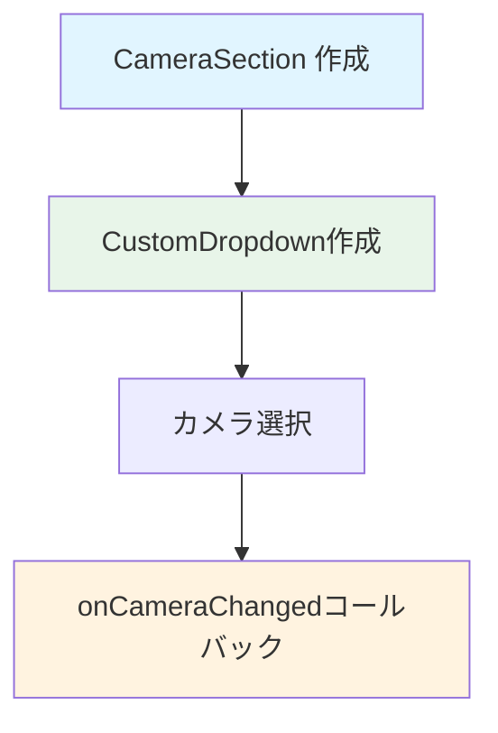

# CameraSection ウィジェット フロー

`CameraSection` は、カメラ選択セクションを表示するウィジェットです。

## 主要な機能

- カメラの選択（1〜4）

## データフロー

## 主要メソッド

### build()
カメラセクションのUIを構築します。

## パラメータ

### コンストラクタパラメータ
- `selectedCamera`: 選択中のカメラ番号
- `onCameraChanged`: カメラ変更時のコールバック

## 関連ファイル

- `lib/widgets/form/camera_section.dart` - 実装ファイル
- [form_tab.md](form_tab.md) - FormTabの詳細
- [../common/custom_dropdown.md](../common/custom_dropdown.md) - CustomDropdownの詳細

