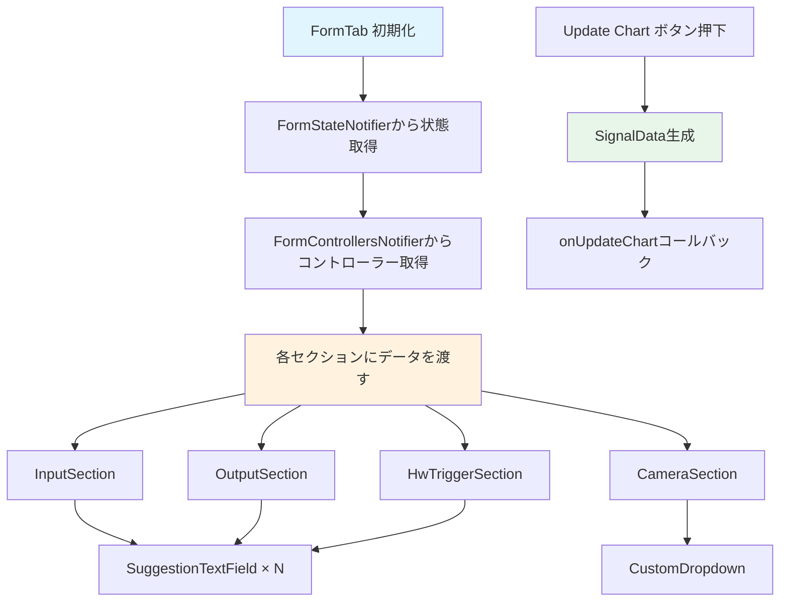
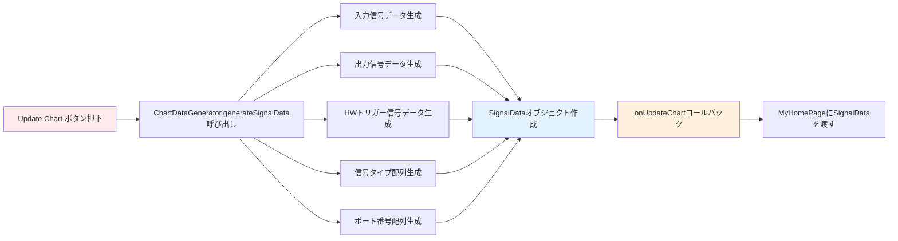

# FormTab ウィジェット フロー

`FormTab` は、タイミングチャートのフォーム入力画面を管理するウィジェットです。

## 主要な機能

- 入力/出力/HW Trigger の信号設定を管理
- カメラ設定とトリガーオプション（Single/Code/Command）の選択
- Camera Configuration Table によるカメラ設定の管理
- Template/Update ボタンによる設定の適用と更新
- 設定のインポート/エクスポート機能

## データフロー



## 初期化フロー

```
[FormTab 作成]
    │
    ├─→ FormStateNotifier から状態取得
    │   ├─→ inputCount
    │   ├─→ outputCount
    │   ├─→ hwPort
    │   ├─→ triggerOption
    │   └─→ cameraCount
    │
    ├─→ FormControllersNotifier からコントローラー取得
    │   ├─→ inputControllers[]
    │   ├─→ outputControllers[]
    │   └─→ hwTriggerControllers[]
    │
    └─→ 各セクションにデータを渡す
```

## Update Chart ボタン処理



## 主要メソッド

### build()
フォームUIを構築します。

### _buildInputSection()
入力セクションを構築します。

### _buildOutputSection()
出力セクションを構築します。

### _onUpdateChart()
チャート更新処理を実行します。
- `ChartDataGenerator.generateSignalData()` を呼び出し
- `SignalData` オブジェクトを作成
- `onUpdateChart` コールバックを呼び出し

## データ構造

### SignalData
チャートに渡す信号データ。
- `signalNames`: 信号名のリスト
- `signals`: 信号値のリスト（各行は時間経過に伴う0/1値のリスト）
- `signalTypes`: 信号タイプのリスト
- `portNumbers`: ポート番号のリスト

## 関連ファイル

- `lib/widgets/form/form_tab.dart` - 実装ファイル
- [input_section.md](input_section.md) - InputSectionの詳細
- [output_section.md](output_section.md) - OutputSectionの詳細
- [hw_trigger_section.md](hw_trigger_section.md) - HwTriggerSectionの詳細
- [camera_section.md](camera_section.md) - CameraSectionの詳細
- [../data_flow/form_to_chart.md](../data_flow/form_to_chart.md) - FormTabからTimingChartへのデータフロー

