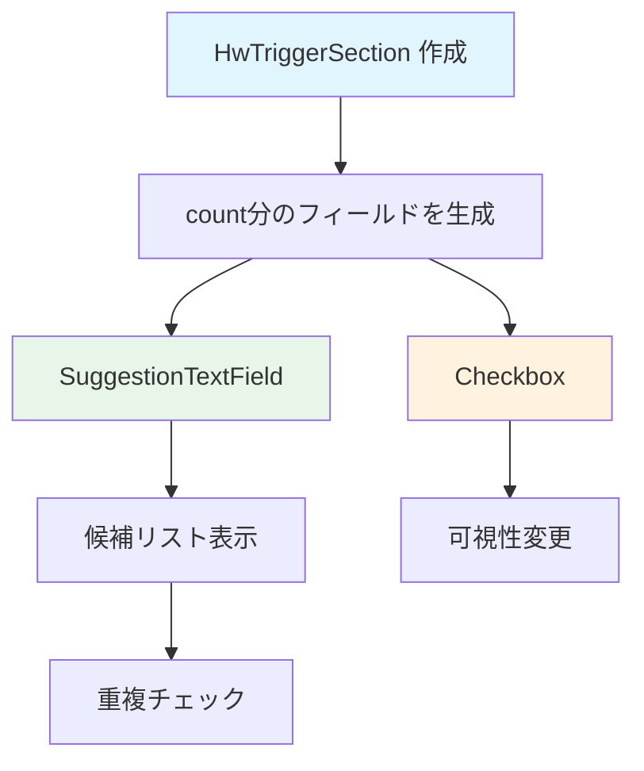

# HwTriggerSection ウィジェット フロー

`HwTriggerSection` は、ハードウェアトリガーセクションを表示するウィジェットです。

## 主要な機能

- ハードウェアトリガーの設定
- 可視性の制御（チェックボックス）

## データフロー

## 主要メソッド

### build()
HWトリガーセクションのUIを構築します。

## パラメータ

### コンストラクタパラメータ
- `controllers`: TextEditingControllerのリスト
- `count`: HWトリガーポート数
- `visibilityList`: 可視性のリスト
- `onVisibilityChanged`: 可視性変更時のコールバック

## 関連ファイル

- `lib/widgets/form/hw_trigger_section.dart` - 実装ファイル
- [form_tab.md](form_tab.md) - FormTabの詳細
- [../common/suggestion_text_field.md](../common/suggestion_text_field.md) - SuggestionTextFieldの詳細

