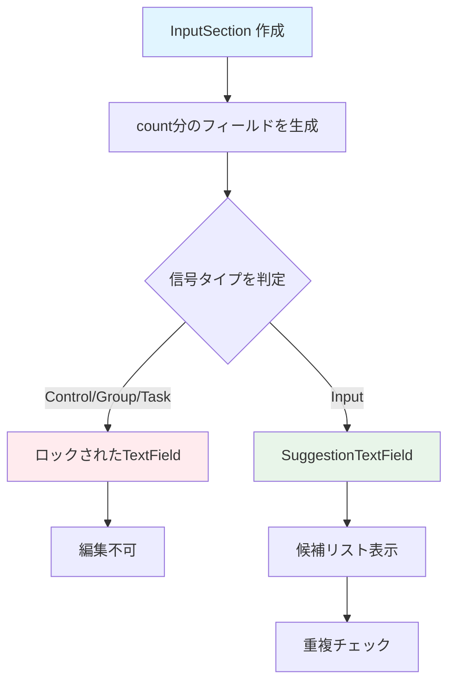

# InputSection ウィジェット フロー

`InputSection` は、入力信号セクションを表示するウィジェットです。

## 主要な機能

- 入力信号の設定
- 信号タイプの自動判定（Control/Group/Task）
- ロックされた信号の表示（編集不可）
- 可視性チェックボックス（ロック対象は表示しない）

## データフロー

## 信号タイプの判定

### Code Trigger モード（32ポート）
- Input2~9: `SignalType.control`
- Input10~15: `SignalType.group`
- Input16~21: `SignalType.task`
- その他: `SignalType.input`

### Code Trigger モード（16ポート）
- Input2~5: `SignalType.control`
- Input6~8: `SignalType.group`
- Input9~14: `SignalType.task`
- その他: `SignalType.input`

## 主要メソッド

### build()
入力セクションのUIを構築します。

### _getSignalType()
信号タイプを取得します。
- `FormTabRules.inferInputSignalType(triggerOption, inputCount, index)` に委譲
- Code Trigger モードの場合、`FormTabConstants` の範囲定義に従って Control/Group/Task を返す

## UI 振る舞い（現状実装）

- **ロック判定**: `SignalType.control/group/task` の行は `TextField(enabled: false)` を表示
- **通常行**: `SuggestionTextField`（候補ロード + 重複チェック）を表示
- **可視性**: ロック行以外にのみ `Checkbox` を表示し、`onVisibilityChanged(index)` を呼び出す

## パラメータ

### コンストラクタパラメータ
- `controllers`: TextEditingControllerのリスト
- `count`: 入力ポート数
- `visibilityList`: 可視性のリスト
- `onVisibilityChanged`: 可視性変更時のコールバック
- `triggerOption`: トリガーオプション（Single/Code/Command）

## 関連ファイル

- `lib/widgets/form/input_section.dart` - 実装ファイル
- [form_tab.md](form_tab.md) - FormTabの詳細
- [../common/suggestion_text_field.md](../common/suggestion_text_field.md) - SuggestionTextFieldの詳細

