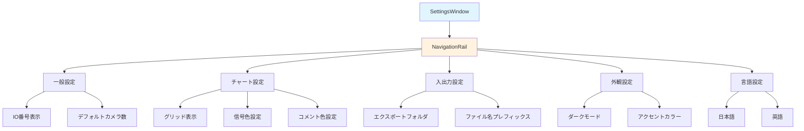

# settings/ フォルダ - 設定関連ウィジェット

このフォルダには、設定ウィンドウのウィジェットのデータフローが含まれています。

## ファイル一覧

- [settings_window.md](settings_window.md) - SettingsWindowの詳細フロー

## 全体構造

## 主要なウィジェット

### SettingsWindow
設定ウィンドウ。NavigationRailを使用してカテゴリを選択し、各カテゴリの設定項目を表示します。

