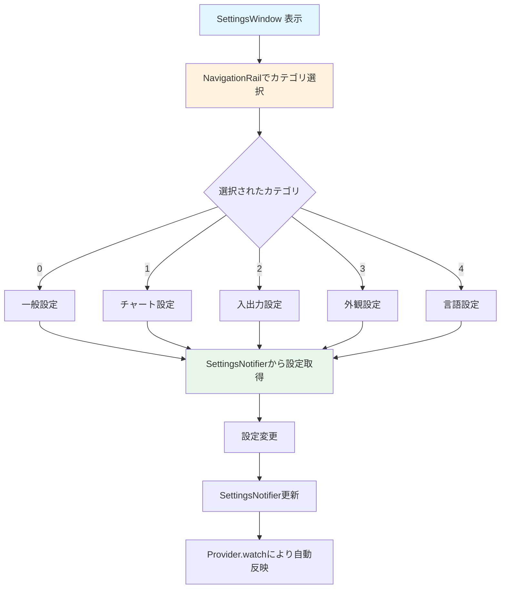

# SettingsWindow ウィジェット フロー

`SettingsWindow` は、環境設定ウィンドウを表示するウィジェットです。

## 主要な機能

- 一般設定
- チャート設定
- 入出力設定
- 外観設定
- 言語設定

## データフロー

## カテゴリ一覧

### 0: 一般設定
- IO番号表示の切り替え
- デフォルトカメラ数の設定

### 1: チャート設定
- グリッド線の表示切り替え
- デフォルトチャート長の設定
- 信号色の設定（入力/出力/HWトリガー）
- コメント色の設定（破線/矢印/省略線）

### 2: 入出力設定
- デフォルトエクスポートフォルダの設定
- ファイル名プレフィックスの設定

### 3: 外観設定
- ダークモードの切り替え
- アクセントカラーの設定

### 4: 言語設定
- 日本語/英語の選択

## 主要メソッド

### build()
設定ウィンドウのUIを構築します。

### _buildPanel()
選択されたカテゴリに応じた設定パネルを構築します。

### _pickColor()
色選択ダイアログを表示します。

## パラメータ

### コンストラクタパラメータ
- `showIoNumbers`: IO番号を表示するかどうか
- `onShowIoNumbersChanged`: IO番号表示変更時のコールバック

## SettingsNotifier との連携

`SettingsNotifier` から設定を取得し、変更時に更新します。変更は `Provider.watch()` により自動的に反映されます。

## 関連ファイル

- `lib/widgets/settings/settings_window.dart` - 実装ファイル
- [../data_flow/state_management.md](../data_flow/state_management.md) - 状態管理の詳細

